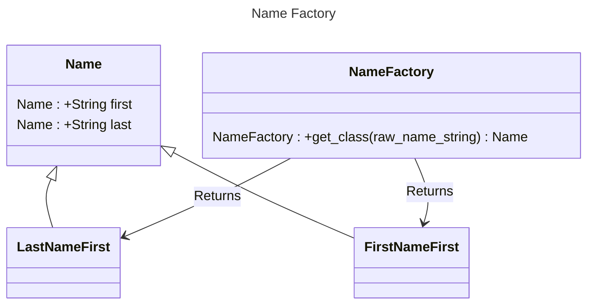

# Chapter 5: The Factory Pattern


- [Notes](#notes)
  - [How a Factory Works](#how-a-factory-works)
  - [A Simple GUI](#a-simple-gui)
  - [Factory Pattern](#factory-pattern)
- [Summary](#summary)
- [Questions](#questions)

## Notes

- The Simple Factory is a very common technique for object creation
- A simple factory returns an instance of one of several possible
  classes depending on the input data
  - Normally all the possible classes are related through an inheritance
    hierarchy
- Allows for returning different objects that provide the same
  *interface* but different *implementation* in response to different
  inputs
- The *Simple Factory* is a more basic version of the general *Factory
  Pattern* which we’ll look at soon

### How a Factory Works

- Consider the simple case of an entry form to receive user’s name

- Might receive it in the format

  1.  “firstname lastname” or,
  2.  “lastname, firstname”

- We assume we can always differentiate between the two forms by the
  presence of a comma

  - The comma delimits the last and first names

- The basic class structure is represented in UML below



- Here `Name` is an abstract base class representing a name
  - `LastNameFirst` and `FirstNameFirst` are concrete implementations
    that handle parsing the respective format into a properly normalised
    name
- The `NameFactory` takes in the raw name string and uses that to
  determine what which `Name` subclass to return
  - Here the programmer doesn’t care about what instance is returned or
    *how* it is created
  - Just care that they pass an approved data format in and get
    something that behaves like a `Name` back
  - This concept scales to more complex object instantiation as well
- We can implement the design above simply enough
  - The base class doesn’t implement any logic, it just defines the
    structure
  - And a simple `__str__` method to control how it’s printed
  - `FirstNameFirst` creates a name by finding the *last* whitespace
    character and splitting on that
    - Every preceding character is assumed to be part of the first name
    - Every subsequent character is assumed to be part of the last name
    - If there is no whitespace to split on, we treat the entire name as
      the last name
  - `LastNameFirst` creates a name by finding a *comma*
    - Preceding characters form the last name, subsequent form the first
      name
    - If there is no comma the entire thing is again treated as the last
      name

``` python
class Name:
    def __init__(self):
        self.first = ""
        self.last = ""

    def __str__(self):
        if self.first:
            return self.first + " " + self.last
        else:
            return self.last


class FirstNameFirst(Name):
    def __init__(self, name_string: str):
        super().__init__()
        if (i := name_string.rfind(" ")) > 0:
            self.first = name_string[0:i].strip()
            self.last = name_string[i + 1 :].strip()
        else:
            self.last = name_string.strip()


class LastNameFirst(Name):
    def __init__(self, name_string: str):
        super().__init__()
        if (i := name_string.find(",")) > 0:
            self.first = name_string[0:i].strip()
            self.last = name_string[i + 1 :].strip()
        else:
            self.last = name_string.strip()


class NameFactory:
    def __init__(self, name_string: str):
        self.name = name_string

    def get_name(self):
        if self.name.find(",") > 0:
            return LastNameFirst(self.name)
        else:
            return FirstNameFirst(self.name)


raw_names = ["Sandy Smith", "Jones, Doug", "Cthulhu"]
names = [NameFactory(name).get_name() for name in raw_names]

for name in names:
    print(type(name), name)
```

    <class '__main__.FirstNameFirst'> Sandy Smith
    <class '__main__.LastNameFirst'> Jones Doug
    <class '__main__.FirstNameFirst'> Cthulhu

### A Simple GUI

- Below demonstrates how to integrate this factory pattern into a simple
  widget that recieves a name and displays the resulting `first` and
  `last` name
  - The full code can be found at
    [01-simple-gui.py](Examples/01-simple-gui/01-simple-gui.py)
  - Below shows the code for the UI

  ``` python
    class NameEntryForm:
        def __init__(self, master):

            master.title("Simple Factory")
            tk.Label(master, text="Enter Name:", foreground="blue").grid(
                row=0, columnspan=3
            )

            self.name_entry = tk.Entry(master)
            self.name_entry.grid(row=1, column=1, sticky=tk.E + tk.W)

            tk.Label(master, text="First name:", foreground="blue").grid(
                row=2, column=0, sticky=tk.W, pady=10
            )
            self.first_name_display = tk.Entry(master)
            self.first_name_display.grid(row=2, column=1, sticky=tk.E, pady=10)

            tk.Label(master, text="Last name:", foreground="blue").grid(
                row=3, column=0, sticky=tk.W, pady=10
            )
            self.last_name_display = tk.Entry(master)
            self.last_name_display.grid(row=3, column=1, sticky=tk.E, pady=5)

            compute_name_button = tk.ttk.Button(
                master, text="Process", command=self.compute_name
            )
            compute_name_button.grid(row=4, column=0, pady=5)

            clear_button = tk.ttk.Button(master, text="Clear", command=self.clear_form)
            clear_button.grid(row=4, column=1, pady=5)

            quit_button = tk.ttk.Button(text="Quit", command=sys.exit)
            quit_button.grid(row=4, column=2, pady=5)

        def compute_name(self):
            raw_name = self.name_entry.get()
            name = NameFactory(raw_name).get_name()

            self.first_name_display.insert(0, name.first)
            self.last_name_display.insert(0, name.last)

        def clear_form(self):
            self.name_entry.delete(0, tk.END)
            self.first_name_display.delete(0, tk.END)
            self.last_name_display.delete(0, tk.END)


    def main():
        root = tk.Tk()
        NameEntryForm(root)
        tk.mainloop()


    if __name__ == "__main__":
        main()
  ```

  - The corresponding output looks like,

    

### Factory Pattern

- Consider a program that uses the Fast Fourier Transform on some data

- In the general case this requires evaluating the following four
  equations

  $$  \begin{align}
        R_{1}^{'} &= R_{1} + R_{2}\cos\left(y\right) - I_{2}\sin\left(y\right) \\
        R_{2}^{'} &= R_{1} - R_{2}\cos\left(y\right) + I_{2}\sin\left(y\right) \\
        I_{1}^{'} &= I_{1} + R_{2}\sin\left(y\right) + I_{2}\cos\left(y\right) \\
        I_{2}^{'} &= I_{1} - R_{2}\sin\left(y\right) - I_{2}\cos\left(y\right)
    \end{align}$$

- Often the $y$ value is $0$ in which case the equations reduce to,

  $$  \begin{align}
        R_{1}^{'} &= R_{1} + R_{2} \\
        R_{2}^{'} &= R_{1} - R_{2} \\
        I_{1}^{'} &= I_{1} + I_{2} \\
        I_{2}^{'} &= I_{1} - I_{2}
    \end{align}$$

- We could use a simple factory class that decides if it should return
  the full equation set or a reduced set

  ``` python
    class FourierEquationsFactory:
        def get_fourier_equations(self, y: float):
            if y:
                return FullFourierEquations(y)
            else:
                return ReducedFourierEquations(y)
  ```

> [!TIP]
>
> **Object-Oriented Programming and Mathematics**
>
> The above example while conceptually *neat* is likely a *very* bad way
> of performing calculations. Modern Linear Algebra packages are
> highly-efficient and often use array-based paradigms for operating on
> large data. Having to build a class *every* iteration to run equations
> will almost definitely be slower than just computing from the full
> equations for each iteration

## Summary

- To summarise the basic factory method
  - An abstraction decides which of several possible classes to return
  - Call methods on the returned object based on the base class
    interface
    - Never explicitly rely on a subclass
  - Data is kept separated from the class methods

## Questions

1.  Consider a personal checkbook management program such as Quicken. It
    manages several bank accounts and investments and can handle your
    bill paying. Where could you use a factory pattern in designing a
    program like this?
    - Different types of accounts probably have similar interfaces, but
      different implementations
    - A factory would be useful to abstract the creation of specific
      account type representations
    - Different payment methods as well may also have similar interfaces
      but different implementations
    - Could use a factory to provide the correct payment method class
      for a given transaction
2.  Suppose you are writing a program to assist homeowners in designing
    additions to their houses. What objects might a Factory be used to
    produce?
    - Different types of furniture potentially have a common interface,
      but different implementation that could be captured in a class?
    - Different room types may have different requirements that need to
      be captured in a class representation
      - Can still generally create new rooms via a factory method
