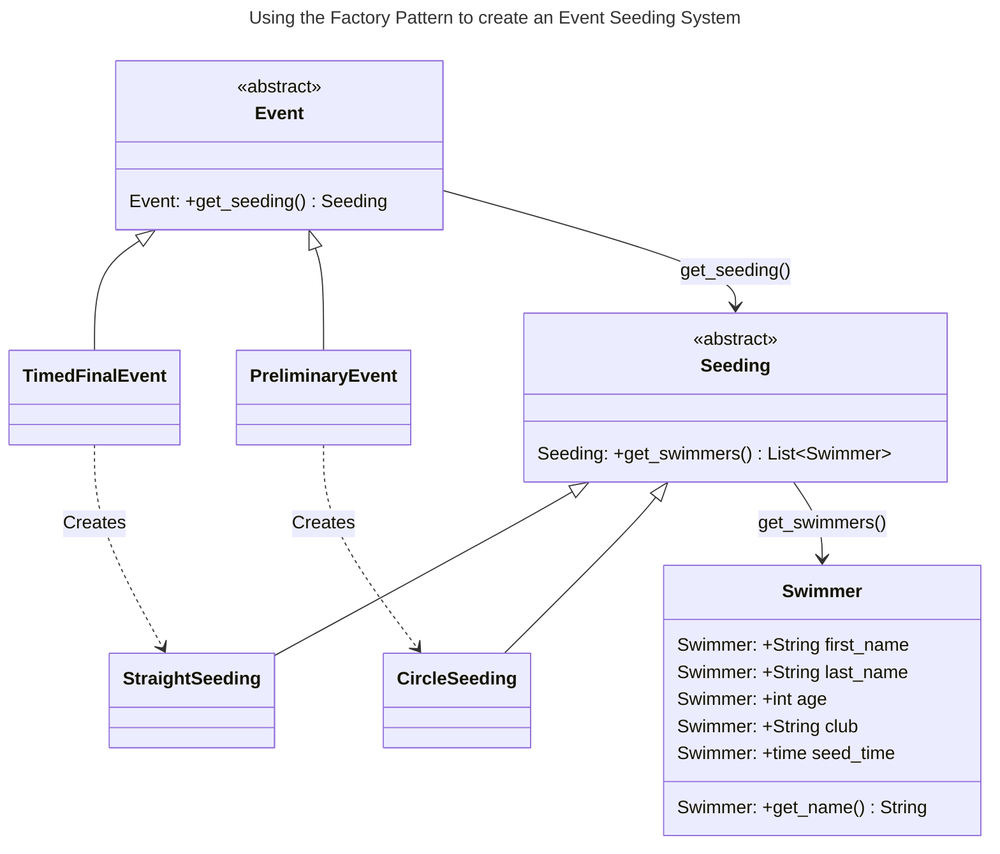

# Chapter 6: The Factory Method Pattern


- [Notes](#notes)
  - [The `Swimmer` Class](#the-swimmer-class)
  - [The `Event` Class](#the-event-class)
  - [The `Seeding` Class](#the-seeding-class)
  - [Other Factories](#other-factories)
- [Summary](#summary)

## Notes

- [Chapter 5](../chapter-05/chapter-05.qmd) demonstrates the concept of
  a *simple factory*
- The Factory Concept is a fundamental and common pattern in
  Object-Oriented Design
  - A single class acts as an authority deciding which subclass of a
    hierarchy is instantiated
- The **Factory Method Pattern** extends this concept
  - No single class decides which subclass to instantiate
  - Superclass defers construction to each subclass
- Programs define an abstract class that creates objects
  - Subclasses decide which object to create
- As a simple example, consider swimmers seeded into swim lanes
  - Swimmers competing in multiple heats are first sorted to compete
    from slowest in early heats to fastest in the last heat
    - Within a heat, the fastest swimmers are in the centre lanes
    - This is a process called *straight seeding*
  - In a championship, swimmers often swim an event twice
    - In preliminaries, everyone competes
    - In finals the top 12 of 16 compete against each other
    - To ensure greater equality, top heats are *circle seeded*
      - Fastest three swimmers are in the centre lane in the fastest
        three heats
      - Second fastest are in the lane next to the centre in the top
        three, etc.
- We want to create a program that can automatically perform this
  seeding for us
  - Need to create a class hierarchy to represent events and their
    seeding
  - The basic idea is as follows,
    - An `Event` acts as a factory class for `Seeding` via the
      `get_seeding` method
    - Concrete `Event` subclasses redefine `get_seeding` to control how
      they are seeded
      - In this case to chose which `Seeding` subclass they want to use
    - `Swimmer` is a utility class for keeping track of swimmers
- The UML below shows the rough structure



### The `Swimmer` Class

- The `Swimmer` class is a basic class designed to store information
  about a Swimmer
  - Namely,
    1.  Name
    2.  Age
    3.  Club
    4.  Seed time
    5.  Seeded lane
    6.  Heat
- We’ll use a common Python pattern for handling object creation which
  is to define a generic `__init__` that accepts the required parameters
  - We then define *class methods* to handle the various ways that one
    might want to provide that data

    - For example, from a text file
    - Means we can extend to accept new formats like a database row by
      adding a new class method as opposed to re-tooling our `__init__`
    - This reduces coupling between the data storage format and the
      object creation mechanism

  - We provide a class method `from_str` that converts from a
    *delimited* string like on might get from a csv file

    - The rest of the class is a very simple class that just holds data
      - `heat` and `lane` are set to $0$ to denote they have not been
        set
      - Real heats and lanes are indexed from $1$

    ``` python
    class Swimmer:
        """Represents a Swimmer competing in an Event

        Attributes
        ----------
        first_name: str
            swimmer's first name
        last_name: str
            swimmer's last name
        age : int
            swimmer's current age in years
        club : str
            club the swimmer is representing
        seed_time : datetime.time
            swimmer's seed time
        heat: int
            swimmer's allocated heat, 0 represents an unallocated swimmer
        lane: int
            swimmer's allocated lane, 0 represents an unallocated swimmer
        """

        @classmethod
        def from_string(cls, swimmer: str, delimiter=" ") -> Swimmer:
            """Create a swimmer from a delimited string

            Converts a delimited string into a `Swimmer`, the string is split into
            arguments to the `Swimmer` constructor by the delimiter, and must follow
            the structure below, where ``[x]`` represents a delimited chunk
            corresponding to the parameter `x`

            ``[first_name][last_name][age][club][seed_time]``

            The parameters must be represented in the following formats,

            * `first_name` - `str`
            * `last_name` - `str`
            * `age` - `int`
            * `club` - `str`
            * `seed_time` - either `%M:%S.%f` or `%S.%f`

            Parameters
            ----------
            swimmer : str
                swimmer represented as parameter delimited by the delimiter

            delimiter : str, optional
                The delimiting symbol uses to split the string, by default " "

            Returns
            -------
            Swimmer
                swimmer described by the provided string

            Raises
            ------
            ValueError
                Could not convert the provided string to a `Swimmer` instance
            """

            swimmer_parameters = [
                parameter for parameter in swimmer.split(sep=delimiter) if parameter
            ]

            if len(swimmer_parameters) != 5:
                raise ValueError(
                    f"Swimmer requires 5 parameters, got {len(swimmer_parameters)}\n{swimmer_parameters}"
                )

            swimmer_parameters = [parameter.strip() for parameter in swimmer_parameters]

            first_name = swimmer_parameters[0]
            last_name = swimmer_parameters[1]
            age = int(swimmer_parameters[2])
            club = swimmer_parameters[3]

            seed_time = parse_time(swimmer_parameters[4])

            return cls(first_name, last_name, age, club, seed_time)
    ```

  - We have a very simple `parse_time` function which helps convert a
    string representing a seed time into an actual `datetime.time`

    ``` python
        import datetime

        def parse_time(timecode: str) -> datetime.time:
            """Parse a seed timecode to a time

            Parameters
            ----------
            timecode : str
                seed time represented in either `%M:%S.%f` or `%S.%f` ISO format

            Returns
            -------
            `datetime.time`
                time corresponding to the provided time code

            Raises
            ------
            ValueError
                Raised if `timecode` is not in a supported format
            """
            try:
                time = datetime.time.strptime(timecode, "%M:%S.%f")
            except ValueError:
                time = datetime.time.strptime(timecode, "%S.%f")
            return time

        print("%M:%S.%f type time:", parse_time("30:30.5"))
        print("%S.%f type time:", parse_time("30.5"))
    ```

        %M:%S.%f type time: 00:30:30.500000
        %S.%f type time: 00:00:30.500000

  - Lastly, we define a standalone method that read’s a list of swimmers
    from a file and convert’s them to `Swimmer` objects

    ``` python
    def load_swimmers(filename: str, delimiter=" ") -> list[Swimmer]:
        """
        Load swimmers from a delimited file

        Load's swimmer's from a delimited file into a list of `swim_events.Swimmer`
        instances. Does not populate their heat and lane.

        Assumes the file follow's the interface of `swim_events.Swimmer.from_string`

        Parameters
        ----------
        filename : str
            path to the file containing swimmers, can be absolute or relative

        Returns
        -------
        list[Swimmer]
            list of Swimmer objects corresponding to rows in the file
        """
        # extract swimmers from file, slicing off the initial "idx " substring
        with open(filename, "r") as f:
            swimmers = [
                Swimmer.from_string(line.partition(" ")[2], delimiter=delimiter)
                for line in f.readlines()
            ]
        return swimmers
    ```

### The `Event` Class

- The `Event` class acts as our abstract base class for defining *what*
  seeding objects should be created
  - It is the core of our *factory method pattern*
  - We define an abstract method `seeding` which returns a `Seeding`
    instance
    - This is the factory method that is overwritten by specific
      subclasses
  - Otherwise it provides an initialiser that accepts a sequence of
    `Swimmer` instances and the number of lanes in each heat

  ``` python
    class Event(abc.ABC):
        """
        Abstract Class representing a generic swimming event

        Subclasses should override the `seeding` factory method to create the
        appropriate seeding instance for the event type

        Attributes
        ----------
        swimmers: Sequence[Swimmer]
            swimmers competing in the event
        number_of_lanes: int
            number of lanes in each heat
        """

        def __init__(self, swimmers: Sequence[Swimmer], lanes: int):
            """
            Create a new event instance with the provided swimmers and the
            given number of lanes per heat

            Parameters
            ----------
            swimmers: Sequence[Swimmer]
                Swimmers competing in the event
            lanes: int
                Number of lanes per heat
            """
            self.number_of_lanes = lanes
            self.swimmers = swimmers

        @abc.abstractmethod
        def seeding(self) -> Seeding:
            """
            Create the seeding for the event

            Returns
            -------
            Seeding
                The seeding methodology to be used for the event
            """
            pass
  ```
- We then define two subclasses
  1.  `PreliminaryEvent`

      - Implements `seeding` to return a `CircleSeeding` instance

      ``` python
         class PreliminaryEvent(Event):
             """
             A Preliminary Swimming Competition Event with circle seeding
             """

             @override
             def seeding(self) -> Seeding:
                 return CircleSeeding(self.swimmers, self.number_of_lanes)
      ```

  2.  `TimedFinalEvent`

      - Implements `seeding` to return a `StraightSeeding` instance

      ``` python
         class TimedFinalEvent(Event):
             """
             A Timed Swimming Competition Event using straight seeding
             """

             @override
             def seeding(self) -> Seeding:
                 return StraightSeeding(self.swimmers, self.number_of_lanes)
      ```

### The `Seeding` Class

- The hierarchy to define now is the `Seeding` abstract base class

  - This class implements two behaviours

    1.  It stores the swimmers competing in an event in a *sorted* list
        in increasing seed time
    2.  Seeds the swimmers into heats and lanes via the `seed` abstract
        method
        - Called as part of the `__init__` method

  ``` python
    class Seeding(abc.ABC):
        """
        Abstract Class representing a methodology for seeding an event

        Distributes a roster of swimmer's across heats and lanes according to
        the desired seeding method. Seeding is performed on object creation and
        does not require an explicit call to `seed`


        Subclasses should override the `seed` method to implement the desired
        seeding methodology

        Attributes
        ----------
        swimmers: Sequence[Swimmer]
            swimmers to be seeded, sorted by increasing seed time
        number_of_lanes: int
            number of lanes in each heat
        number_of_heats: int
            number of heats in the event
        """

        def __init__(self, swimmers: Sequence[Swimmer], number_of_lanes: int):
            self.swimmers = sorted(swimmers, key=lambda x: x.seed_time)
            self.number_of_lanes = number_of_lanes
            self.number_of_heats = 0

            self.seed()

        @abc.abstractmethod
        def seed(self) -> None:
            """
            Seed swimmers into a designated heat and lane

            Each swimmer in `self.swimmers` must have their `heat` and `lane`
            attribute assigned after `seed` is called. A `(heat, lane)` pair
            must be unique
            """
            pass
  ```

- We then implement two subclasses `StraightSeeding` and `CircleSeeding`

  - `StraightSeeding` inherit’s directly from `Seeding` to implement
    it’s `seed` method

    ``` python
       class StraightSeeding(Seeding):
           """
           Straight seeds an event

           Heats are seeded slowest to fastest, with the fastest swimmers
           in the center lanes
           """

           @override
           def seed(self) -> None:
               """
               Seed swimmers into a designated heat and lane

               Heats are seeded slowest to fastest, with the fastest swimmers
               in the center lanes
               """
               # calculate number of swimmers in the last heat, we want it to be a minimum of three
               # unless there are only two competitors
               n_swimmers_in_last_heat = len(self.swimmers) % self.number_of_lanes
               if n_swimmers_in_last_heat < 3:
                   n_swimmers_in_last_heat = min(3, len(self.swimmers))

               # calculate number of lanes in the normal heat
               # and the total number of heats
               remaining_lanes = len(self.swimmers) - n_swimmers_in_last_heat
               self.number_of_heats = len(self.swimmers) // self.number_of_lanes + (
                   1 if remaining_lanes else 0
               )

               # generate the lane orderings and set to repeat for as we cycle over the heats
               lane_ordering = itertools.cycle(self.generate_lane_order())

               # cycle over the heats performing the seeding
               for idx, (lane, swimmer) in enumerate(
                   zip(lane_ordering, self.swimmers[:remaining_lanes])
               ):
                   swimmer.lane = lane
                   swimmer.heat = self.number_of_heats - (idx // self.number_of_lanes)

               # if no left over heat, return now
               if not n_swimmers_in_last_heat:
                   return

               # otherwise seed the final heat
               for lane, swimmer in zip(
                   self.generate_lane_order(), self.swimmers[-n_swimmers_in_last_heat:]
               ):
                   swimmer.lane = lane
                   swimmer.heat = 1

           def generate_lane_order(self) -> Sequence[int]:
               """
               The order to assign lanes within a heat

               Returns
               -------
               Sequence[int]
                   The order in which lanes are seeded.
                   Lanes start at 1.
               """

               mid = self.number_of_lanes // 2 + self.number_of_lanes % 2

               incr = 1
               lane = mid
               lanes = []
               for i in range(self.number_of_lanes):
                   lanes.append(lane)
                   lane = mid + incr
                   incr = -incr + (1 if incr < 0 else 0)

               return lanes
    ```

  - Circle seeding is a slight variation of the straight seeding method

    - We thus implement it as a subclass of `CircleSeeding`

    ``` python
        class CircleSeeding(StraightSeeding):
            """
            Circle seeds an event

            As for straight seeding but the fastest swimmers are distributed to the
            top three heats as in the diagram below

            ``(7, 1, 4), (8, 2, 5), (9, 3, 6)``
            """

            @override
            def seed(self) -> None:
                """
                Seed swimmers into a designated heat and lane

                Heats are seeded slowest to fastest, with the fastest swimmers
                in the center lanes. The fastest swimmers are distributed across the
                top 3 heats.

                ``(7, 1, 4), (8, 2, 5), (9, 3, 6)``
                """

                # start by straight-seeding
                super().seed()
                if self.number_of_heats <= 1:
                    return

                # Calculate, number of heats to be circle seeded, if only one heat
                # return early
                number_to_circle_seed = min(3, self.number_of_heats)

                # Reseed the final `number_to_circle_seed`
                lane_ordering = itertools.cycle(self.generate_lane_order())

                for swimmer, (lane, heat) in zip(
                    self.swimmers[: self.number_of_lanes * number_to_circle_seed],
                    itertools.product(
                        itertools.islice(
                            lane_ordering, number_to_circle_seed * self.number_of_lanes
                        ),
                        range(number_to_circle_seed),
                    ),
                ):
                    swimmer.lane = lane
                    swimmer.heat = self.number_of_heats - heat
    ```

- The full code above can be found in
  [swim_events.py](./Examples/swimmers/swim_events.py)

- We can then implement two interfaces for this program

  1.  [A command line application](./Examples/swimmers/swim_console.py)

      ``` python
         from typing import Sequence

         import swim_events


         def select_event(event_id: int) -> Sequence[swim_events.Swimmer]:
             """
             Select and seed a corresponding event

             Parameters
             ----------
             event_id : int
                 integer id corresponding to a specific event

             Returns
             -------
             Sequence[swim_events.Swimmer]
                 Swimmers competing in the event seeded into heats and lanes, sorted
                 in ascending seed time

             Raises
             ------
             ValueError
                 Raised if `event_id` does not correspond to an event
             """
             if event_id == 1:
                 print("loading swimmers")
                 swimmers = swim_events.load_swimmers("100free.txt")
                 print("swimmers loaded\nGenerating event")
                 event = swim_events.PreliminaryEvent(swimmers, 6)
                 print("Event retrieved")
             elif event_id == 5:
                 swimmers = swim_events.load_swimmers("500free.txt")
                 event = swim_events.TimedFinalEvent(swimmers, 6)
             else:
                 raise ValueError(f"No event found corresponding to {event_id}")

             print("Seeding")
             seeding = event.seeding()
             swimmers = seeding.swimmers  # get's the sorted swimmers list
             print("Finished seeding")
             return swimmers


         class SwimEventConsoleUI:
             def build(self):
                 while distance := int(input("Select Event (1 - 100 m, 5 - 500 m, 0 - quit): ")):
                     try:
                         swimmers = select_event(distance)
                     except ValueError as e:
                         print(e)
                     else:
                         for swimmer in swimmers:
                             print(
                                 f"{swimmer.heat:3}{swimmer.lane:3} {swimmer.name:20}{swimmer.age:3}{swimmer.seed_time:9}"
                             )


         def main():
             console = SwimEventConsoleUI()
             console.build()


         if __name__ == "__main__":
             main()
      ```

  2.  [A simple graphical program](./Examples/swimmers/swim_events.py)

      - The program should look something like,

        

### Other Factories

- One issue currently is that our program needs a way to determine which
  `Event` subclass to instantiate

- At the moment this is hardcoded. For example in the GUI we use a
  hard-coded look-up table associating files to subclasses

  ``` python
    def select_swim_event(self, event):
        """
        Callback to handle when the currently selected event changes

        Updates the displayed table to correspond to the selected event
        in `self.event_list`

        Parameters
        ----------
        event:
            tkinter event that triggered this callback
        """
        index = int(self.event_list.curselection()[0])

        # store events in an internal look-up table of
        # the data file and the corresponding event type
        events: list[tuple[str, type[swim_events.Event]]] = [
            ("500free.txt", swim_events.TimedFinalEvent),
            ("100free.txt", swim_events.PreliminaryEvent),
        ]

        try:
            event_file, event_format = events[index]
            swimmers = swim_events.load_swimmers(event_file, delimiter=" ")
        except IndexError:
            tk.messagebox.showerror(
                title="Invalid Event Selected",
                message="Current Selection does not match any event",
            )
            return
        except FileNotFoundError:
            tk.messagebox.showerror(
                title="File Missing", message=f"Could not find event file {event_file}"
            )
            return
        swim_event = event_format(swimmers, lanes=6)
        seeded_swimmers = swim_event.seeding().swimmers

        self.update_table(seeded_swimmers)
  ```

  - Eventually we might want to replace this with another factory
    in-kind, e.g. an `EventFactory`

## Summary

- Consider a factory method when

  1.  A class can’t anticipate which kind of objects of a class it must
      create
  2.  A class uses it’s subclass to delegate which objects it creates
  3.  You want to localise knowledge of which class is created

- There are variations on the factory pattern, for example

  1.  The base class is abstract

      - The pattern returns a working class

  2.  The base class contains a default implementation

      - Subclasses override the default implementation

  3.  Parameters are passed to the factory method to determine which
      type of class to return

      - Classes may share method names / interfaces
      - Implement different behaviours
