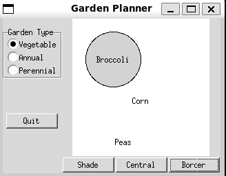

## Notes

- The **Abstract Factory Pattern** is an extension on the concept of the [Factory Pattern](../chapter-06/chapter-06.qmd)
- Rather than returning a *subclass* of a given *class* we instead use an abstract factory to return a *family* of subclasses from a family of related classes
  - In other words, the Abstract Factory is a factory that returns groups of classes
    - Those groups might then in turn use a factory to determine which class from the group is returned

- A traditional example is in GUI design. A program might need to support different styles of Widgets depending on the OS (Windows, Gnome, OS/X etc)
  - One abstract factory might return the set of Windows widgets
  - Another might return the set of Gnome widgets etc.
- Can then request specific widget's from the respective factory instance

### A GardenMaker Factory

- Consider a simple program for planning out a garden
  - The program supports a number of different garden types

    1. Annual Gardens
    2. Vegetable Gardens
    3. Perennial Gardens

- For each type of garden, we have the following requirements

  1. What are good border plants?
  2. What are good centre plants?
  3. What plants do well in partial shade?

- Our Abstract factory class will be a `Garden`
  - It returns the associated `Plant` types
    - In this case they will be specific instances of `Plant` rather than distinct subclasses
  - Special concrete subclasses of `Garden` will return different instances of `Plant`, Namely
    - `AnnualGarden`
    - `VegetableGarden`
    - `PerennialGarden`

- We can depict the resulting UML
```{mermaid}
---
title: Using the Abstract Factory Pattern to Create a Garden Planner
---
classDiagram

    class Garden {
        <<abstract>>
        +shade_plant() Plant
        +centre_plant() Plant
        +border_plant() Plant
    }

    class Plant {
        +String name
    }

    class AnnualGarden
    class VegetableGarden
    class PerennialGarden

    Garden <|-- AnnualGarden
    Garden <|-- VegetableGarden
    Garden <|-- PerennialGarden

    Garden --> Plant : Instantiates
```

#### The `Plant` Class

- For this simple case, rather than defining a range of different classes we'll look at one specific `Plant` instance

  ```python
    class Plant:
        """
        Represents a plant in a garden

        Attributes
        ----------
        self.name : str
            Plant's name (common or scientific)
        """

        def __init__(self, name) -> None:
            """
            Create a new plant instance with the given name

            Parameters
            ----------
            name : str
                name of the plant (common or scientific)
            """
            self.name = name
  ```


#### The `Garden` Class

- We first define our `Garden` base class which provides three different methods for getting various plant types
  - In a more complex implementation these might be different classes from different hierarchies

  ```python
    class Garden(abc.ABC):
        """
        Abstract class representing a garden

        Provides methods for retrieving plant's suitable
        for that garden.

        Subclasses should override the

        * `get_shade_plant`
        * `get_centre_plant`
        * `get_border_plant`

        methods to return the appropriate `Plant` instances
        """

        @abc.abstractmethod
        def get_shade_plant(self) -> Plant:
            """
            Retrieve a plant corresponding to this garden
            that can live in the shade

            Returns
            -------
            Plant
                A shade-loving plant
            """
            pass

        @abc.abstractmethod
        def get_centre_plant(self) -> Plant:
            """
            Retrieve a plant corresponding to this garden
            that can live in the centre

            Returns
            -------
            Plant
                A centre-loving plant
            """
            pass

        @abc.abstractmethod
        def get_border_plant(self) -> Plant:
            """
            Retrieve a plant corresponding to this garden
            that can live on the border

            Returns
            -------
            Plant
                A border-loving plant
            """
            pass
  ```

- Now we implement our three specific class implementations

  ```python
    class VegetableGarden(Garden):
        """
        Factory for a Vegetable Garden
        """

        @override
        def get_shade_plant(self) -> Plant:
            return Plant("Broccoli")

        @override
        def get_centre_plant(self) -> Plant:
            return Plant("Corn")

        @override
        def get_border_plant(self) -> Plant:
            return Plant("Peas")


    class AnnualGarden(Garden):
        """
        Factory for an Annual Garden
        """

        @override
        def get_shade_plant(self) -> Plant:
            return Plant("Coleus")

        @override
        def get_centre_plant(self) -> Plant:
            return Plant("Marigold")

        @override
        def get_border_plant(self) -> Plant:
            return Plant("Alyssum")


    class PerennialGarden(Garden):
        """
        Factory for a Perennial Garden
        """

        @override
        def get_shade_plant(self) -> Plant:
            return Plant("Astible")

        @override
        def get_centre_plant(self) -> Plant:
            return Plant("Dicentrum")

        @override
        def get_border_plant(self) -> Plant:
            return Plant("Sedum")
  ```

- The full code is included in [garden.py](Examples/garden/garden.py)

#### The Garden Maker GUI

- Now we implement our simple GUI program
- We provides a radio button checkbox that let's us select the garden type
    - The `gardener` is responsible for drawing the current garden
    - Each choice is associated with one specific `garden` type
    - Selecting this button updates the `gardener` so that's current garden corresponds to this choice

  ```python
    class GardenChoiceButton(tk.Radiobutton):
        """
        Specialised Radio Button for selecting a type of garden

        Attributes
        ----------
        garden : garden.Garden
            garden associated with this choice
        gardener : Gardener
            gardener object responsible for drawing the
            garden
        """

        def __init__(
            self,
            root,
            name: str,
            garden: garden.Garden,
            gardener: Gardener,
            index: int,
            group: tk.IntVar,
        ) -> None:
            """
            Create a new choice and associate it to a given radio button group

            Parameters
            ----------
            root :
                parent widget
            name : str
                display name for this choice
            garden : garden.Garden
                garden instance associated with this class
            gardener : Gardener
                gardener object responsible for drawing the
                garden
            index : int
                index for this choice within the group
            group : tk.IntVar
                variable corresponding to the choice button group
            """

            super().__init__(
                root, text=name, command=self.command, variable=group, value=index
            )

            self.pack(anchor=tk.W)
            self.garden = garden
            self.gardener = gardener

        def command(self) -> None:
            """
            Set the gardener to draw the current garden and clear the canvas
            """
            self.gardener.garden = self.garden
            self.gardener.clear_canvas()
  ```

  - We can then create our specific buttons

    ```python
        GardenChoiceButton(
            garden_type_label_frame,
            "Vegetable",
            index=0,
            garden=garden.VegetableGarden(),
            gardener=self,
            group=garden_selected,
        )

        GardenChoiceButton(
            garden_type_label_frame,
            "Annual",
            index=1,
            garden=garden.AnnualGarden(),
            gardener=self,
            group=garden_selected,
        )

        GardenChoiceButton(
            garden_type_label_frame,
            "Perennial",
            index=2,
            garden=garden.PerennialGarden(),
            gardener=self,
            group=garden_selected,
        )
    ```

  - After this we can use the standard buttons to plot the associated plants

    ```python
        class DerivedButton(tk.ttk.Button):
            """
            A button that contains it's own callback

            Subclasses should implement the `command` method

            Parameters
            ----------
            gardener : Gardener
                gardener object responsible for drawing the
                garden
            """

            def __init__(self, master, gardener: Gardener, **kwargs) -> None:
                """
                Create a new instance for the given `gardener`

                Parameters
                ----------
                master :
                    Parent widget
                gardener : Gardener
                    gardener object responsible for drawing the
                    garden
                """

                super().__init__(master, command=self.command, **kwargs)
                self.gardener = gardener

            @abc.abstractmethod
            def command(self) -> None:
                """
                The callback to be executed the button is clicked
                """
                pass


        class ShadeButton(DerivedButton):
            """
            Button for setting a shade plant
            """

            def __init__(self, master, gardener: Gardener, **kwargs) -> None:
                super().__init__(master, gardener, **kwargs)

            def command(self) -> None:
                self.gardener.set_shade_plant()


        class CentreButton(DerivedButton):
            """
            Button for setting the centre plant
            """

            def __init__(self, master, gardener: Gardener, **kwargs) -> None:
                super().__init__(master, gardener, **kwargs)

            def command(self) -> None:
                self.gardener.set_centre_plant()


        class BorderButton(DerivedButton):
            """
            Button for setting the border plant
            """

            def __init__(self, master, gardener: Gardener, **kwargs) -> None:
                super().__init__(master, gardener, **kwargs)

            def command(self) -> None:
                self.gardener.set_border_plant()
    ```


- The full code is found in [garden_gui.py](Examples/garden/garden_gui.py) above should look result in a program that looks like below

  

### Consequences on an Abstract Factory

- Isolate concrete classes from the client
  - Client only interacts with the abstract classes or interfaces returned by the Factory
  - Decouples the concrete implementations of concrete classes from their use
- Since the one factory co-locates the instantiation of classes from across a family reduces the risk of using incompatible classes
- Adding new families is difficult since you there are more methods that require implementation with a simple factory
  - Extending families is more difficult since then *every* subclass needs to implement the new methods

#### A Limitation

- A limitation of factory methods is that since we operate on the *interface* or *base class* if a subclass provides additional methods we have no way of knowing about them
  - Since python is duck-typed we can just assume the methods exist
  - Or we have to perform some form of `isinstance` test

## Summary

- The abstract factory extends the factory pattern to return a family of classes rather than a specific class
- Useful for abstracting the creation of objects and decoupling the client from the concrete implementation of a given class
  - Helps when ensuring a set of classes are mutually compatible
