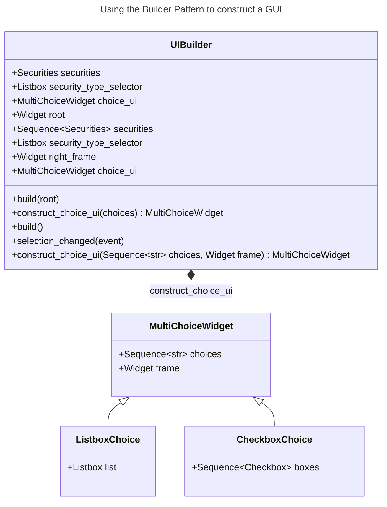

# Chapter 9: The Builder Pattern

- [Notes](#notes)
  - [An Investment Tracker](#an-investment-tracker)
    - [The `MultiChoiceWidget`](#the-multichoicewidget)
    - [The `UIBuilder` Method](#the-uibuilder-method)
    - [Displaying Selected Securities](#displaying-selected-securities)
  - [Summary](#summary)
- [Questions](#questions)

## Notes

- The factory patterns previously discussed ([Chapter
  5](../chapter-05/chapter-05.qmd), [Chapter
  6](../chapter-06/chapter-06.qmd), [Chapter
  7](../chapter-07/chapter-07.qmd)) deal with instantiating different
  subclass variants of a class hierarchy
- A related but similar problem is how to handle if we want to customise
  an instance of the one class
- For example, consider an address book
  - An address might be a,

    1. A Person, comprising

        - First name
        - Last name
        - Company
        - Email
        - Phone Number

    2. Group, comprising

        - Name
        - Purpose
        - Members
          - Their email addresses

  - We want a different display to be constructed for each address type

    - Not a factory here because each object has to be configured
      differently rather than just overriding methods

### An Investment Tracker

- We’ll work with a simpler example of an investment tracker program

- Tracks,

  1. Stocks
  2. Bonds
  3. Mutual Funds

- We want to be able to display each category

- Then select a sub-selection of investments in that category

  - Plot their comparative performance

- We need our display to handle a variable number of plots

  - For a large number of choices we use a listbox with multiple
    selections
  - For three or less we use a series of checkbox values

- We need a builder class that can choose how to configure the UI



#### The `MultiChoiceWidget`

- The core of the program is the `MultiChoiceWidget` we construct to
  display different types of data

- `MultiChoiceWidget` itself is an abstract class

  - It defines a basic initializer containing the parent widget and the
    selection of choices to contain
  - We then define abstract methods
    - `make_ui` which the widget uses to construct itself
    - `get_selected` returns the current selection
  - We define a concrete method `clear_all` that deletes this widget
    from it’s parent frame
    - This enables us to easily swap in and out different
      `MultiChoiceWidgets`

    ``` python
    class MultiChoiceWidget(abc.ABC):
      """
      Abstract widget that allows the user to select multiple options from a collection

      Once instantiated the UI must be constructed via the `make_ui` method.
      Subclasses should override the `make_ui` and `get_selected` methods.

      Parameters
      ----------
      frame
          parent widget
      choices : Sequence[str]
          options that can be selected
      """

      def __init__(self, frame, choices: Sequence[str]) -> None:
          """
          Construct a new MultiChoiceWidget for the given choices

          Parameters
          ----------
          frame :
              parent widget

          choices : Sequence[str]
              choices to add to this widget
          """
          self.choices = choices
          self.frame = frame

      @abc.abstractmethod
      def make_ui(self) -> None:
          """
          Construct the Widget
          """
          pass

      @abc.abstractmethod
      def get_selected(self) -> Sequence[str]:
          """
          Retrieve the currently selected elements

          Returns
          -------
          Sequence[str]
              The currently selected choices
          """
          pass

      def clear_all(self) -> None:
          """
          Delete the current widget from the screen
          """
          for widget in self.frame.winfo_children():
              widget.destroy()
    ```

- We then make two concrete implementations

  1. `ListboxChoice`

      - Implements the multiple choice via a `Listbox`

      ``` python
       class ListboxChoice(MultiChoiceWidget):
           """
           MultipleChoiceWidget implemented via a Listbox

           Parameters
           ----------
           list : tkinter.Listbox
               The listbox
           """

           def __init__(self, frame, choices: Sequence[str]) -> None:
               super().__init__(frame, choices)

           @override
           def make_ui(self) -> None:

               self.clear_all()
               self.list = tk.Listbox(self.frame, selectmode=tk.MULTIPLE)
               self.list.pack()

               for choice in self.choices:
                   self.list.insert(tk.END, choice)

           @override
           def get_selected(self) -> Sequence[str]:

               selection: Sequence[str] = [
                   self.list.get(idx) for idx in self.list.curselection()
               ]
               return selection
      ```

  2. `CheckboxChoice`

      - Implements the multiple choice via checkboxes

      ``` python
         class CheckboxChoice(MultiChoiceWidget):
             """
             MultipleChoiceWidget implemented via a Checkbox

             Parameters
             ----------
             boxes: Sequence[Checkbox]
                 checkboxes associated with this widget
             """

             def __init__(self, panel, choices: Sequence[str]) -> None:
                 super().__init__(panel, choices)

             def make_ui(self) -> None:
                 self.clear_all()

                 self.boxes: list[Checkbox] = []
                 for row, name in enumerate(self.choices):
                     cb = Checkbox(self.frame, name)
                     cb.grid(row=row, column=0, sticky=tk.W)
                     self.boxes.append(cb)

             def get_selected(self) -> Sequence[str]:
                 items: list[str] = [box.text for box in self.boxes if box.is_checked()]
                 return items
      ```

#### The `UIBuilder` Method

- We now define a builder class responsible for constructing the widgets

  - First we define a simple factory method that chooses the correct
    `MultiChoiceWidget`
    - As the implementation becomes more complex we might delegate this
      out to a distinct *Factory class*

  ``` python
    def construct_choice_ui(self, choices: Sequence[str], frame) -> MultiChoiceWidget:
        """
        Build the appropriate `MultiChoiceWidget` for the given selection

        Parameters
        ----------
        choices : Sequence[str]
            options to add to the MultiChoiceWidget
        frame :
            parent widget to place the MultiChoiceWidget into

        Returns
        -------
        MultiChoiceWidget
            The newly constructed widget
        """
        if len(choices) <= 3:
            return CheckboxChoice(frame, choices)
        else:
            return ListboxChoice(frame, choices)
  ```

  - Next we define our standard `build` methods and create the
    `selection_changed` function to handle choosing between different
    securities

    ``` python
    def build(self) -> None:
        """
        Create the UI and initialise the attributes
        """
        stocks = Securities(
            "Stocks",
            investments=[
                "Cisco",
                "Coca Cola",
                "General Electric",
                "Harley Davidson",
                "IBM",
            ],
        )
        bonds = Securities(
            "Bonds",
            investments=["CT State GO 2024", "New York GO 2026", "GE Corp Bonds"],
        )
        mutuals = Securities(
            "Mutuals",
            investments=[
                "Fidelity Magellan",
                "T Rowe Prices",
                "Vanguard Primecap",
                "Lindner",
            ],
        )

        self.securities = [stocks, bonds, mutuals]

        left_frame = tk.ttk.Frame(self.root)
        left_frame.grid(row=0, column=0)

        self.security_type_selector = tk.Listbox(left_frame, exportselection=tk.FALSE)
        self.security_type_selector.pack()

        for security in self.securities:
            self.security_type_selector.insert(tk.END, security.name)

        self.security_type_selector.bind("<<ListboxSelect>>", self.selection_changed)

        self.right_frame = tk.ttk.Frame(self.root)
        self.right_frame.grid(row=0, column=1)

        def show_selected() -> None:
            """
            Display the currently selected options

            Invokes a Messagebox
            """
            securities = self.choice_ui.get_selected()
            text = "\n".join(securities)
            tk.messagebox.showinfo(title="Selected securities", message=text)

        show_button = tk.ttk.Button(self.root, text="Show", command=show_selected)
        show_button.grid(row=1, column=0, columnspan=2)

    def selection_changed(self, event) -> None:
        """
        Callback function for when the selected securities category has changed

        Creates and applies the correct `MultiChoiceWidget`

        Parameters
        ----------
        event :
            event that triggered the callback
        """
        index = int(self.security_type_selector.curselection()[0])
        security_category = self.securities[index]

        self.choice_ui = self.construct_choice_ui(
            security_category.investments, self.right_frame
        )
        self.choice_ui.make_ui()
    ```

- From a *design patterns* perspective this is not perhaps the best
  example of the builder

  - Here both the individual `MultiChoiceWidget` instances are the
    *builders* and the *product*
  - The `UIBuilder` is more of a *Director* that decides how to call the
    builders

- A good example of the builder pattern in Python is `matplotlib`

  - Normally you start by defining a figure, or axes via one of the
    standard `pyplot` methods
    - Then add on `ticks`, `labels`, `legends` and more

#### Displaying Selected Securities

- In our `build` method we define a *closure* `show_selected`

  - This is used as a callback for the `show` button
  - Brings up a message box displaying the selected entities

  ``` python
    def show_selected() -> None:
        """
        Display the currently selected options

        Invokes a Messagebox
        """
        securities = self.choice_ui.get_selected()
        text = "\n".join(securities)
        tk.messagebox.showinfo(title="Selected securities", message=text)

    show_button = tk.ttk.Button(self.root, text="Show", command=show_selected)
    show_button.grid(row=1, column=0, columnspan=2)
  ```

- The final program can be seen in
  [investment_tracker.py](Examples/investment-tracker/investment_tracker.py)

- When run it should look like the following images depending on which
  `MultiChoiceWidget` is constructed

  

  

### Summary

- The builder pattern

  1. Let’s you vary the internal representation of the built product
      - Hide’s the details of how an object is constructed
  2. Each builder is independent of each other and the wider program
      - Though they may follow a common interface
      - Improves modularity
  3. Products are created in discrete steps
      - Provides more fine-grained control over when we stop
        constructing a product

## Questions

1. Some graphical programs construct menus dynamically based on the
    context of the data being displayed. How can you use a builder
    effectively here?

    - We can use a director class that directs how each menu is
      constructed
    - Different Menu types are then implemented as builder classes
      - Depending on the data provided the appropriate builder is called
      - Components are added to the menu dynamically as discrete steps
        provided by the builder

2. Not all builders must construct visual objects.

    1. What might you use a Builder to construct in the personal
        finance industry

        - Loan programs and credit programs for example might have
          special add-ons that clients can opt-into
        - We wouldn’t want to have to define a factory or constructor
          that used `None` to indicate all optional features
          - Especially if those options were time-limited since they
            would then have to live in the code in-theory indefinitely
        - So instead we should use a builder which can *add-on* these
          options as distinct steps

    2. Suppose you were scoring a track meet made up of five to six
        different events, can you use a builder here?

        - We would likely implement the construction of each event via
          some variation of the factory
        - The builder would then be useful as the marshalling class
          - Provides the mechanism to combine events into a meet
          - Since meets can be made up of different numbers of events or
            different event types the builder gives us flexibility
