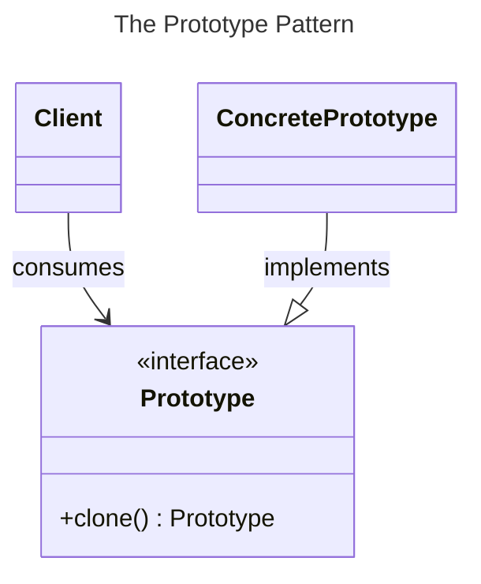
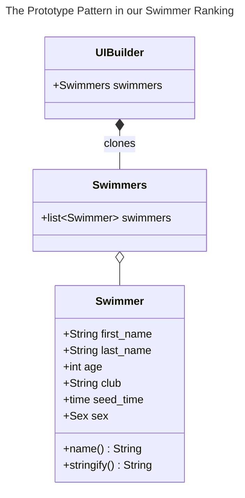

# Chapter 10: The Prototype Pattern


- [Notes](#notes)
  - [Cloning in Python](#cloning-in-python)
  - [Using a Prototype](#using-a-prototype)
    - [The `Swimmer` Class](#the-swimmer-class)
    - [The Prototype Program](#the-prototype-program)
- [Summary](#summary)

## Notes

- The **Prototype Pattern** is used when object creation is expensive or
  complex
  - Rather than building new instances from scratch, a copy is made from
    an existing instance
  - These copies can then be further modified as required
- For example, consider a database in which multiple queries must be
  made to create an answer
  - This might produce a table or results as some object
  - Rather than recreating this table for each subsequent analysis we
    might want to operate on *copies* of this original query
- As a concrete example consider a database of swimmers in a swimming
  league over a season
  - Each swimmer swims several strokes and distances
  - Best times are tabulated by age group
    - Swimmers may have birthdays and move age groups within a season
  - Determining the best swimmer in an age group in a season depends on
    a combination of the dates of each meet and a swimmer’s birthday
    - Expensive to compute this query
    - Once constructed we may want to further analyse this table or
      present it in different sorted orders
      - We don’t want to destroy the original data order or recompute
        the query each time



### Cloning in Python

- Python provides the `copy` module for creating copies of objects,
  there are three main functions

  1.  `copy`

      - Returns a shallow copy of an *object*

  2.  `deepcopy`

      - Returns a deep copy of an *object*

  3.  `replace`

      - Creates a new object of the same type as *object* replacing
        fields with values from *changes*

- A *shallow copy* creates a new copy of the object, but not strictly
  any objects it *references*

- A *deep copy* creates a new copy of the object *and* any object it
  references

### Using a Prototype

- We’ll create an example program
- Here we read data in from
  [Swimmers.txt](Examples/swim_database/Swimmers.txt) to simulate the
  data returned by a database query
- The UML roughly looks like below
  - We take the liberty of treating `Swimmers` as a class, when it is
    really just a list to emphasise the point
    - Here the role of the `clone` function is replaced by calling
      `sorted` on the list instance



#### The `Swimmer` Class

- We can reuse the `Swimmer` class from [Chapter
  6](../chapter-06/chapter-06.qmd)
  - We make some modifications to remove the `heat` and `lane` and add
    in a `sex` parameter
  - We also need to change how we parse the name
- We’ll create specialised parse functions for the name and sex
  - `parse_name`

    ``` python
      def parse_name(name: str) -> tuple[str, str]:
          """
          Parse a name into first and last name components

          Assumes the name is formatted as `"first last"`

          Parameters
          ----------
          name : str
              Name to be parsed

          Returns
          -------
          tuple[str, str]
              first, and last name components
          """
          first_name, _, last_name = name.partition(" ")
          first_name = first_name.strip()
          last_name = last_name.strip()

          return first_name, last_name
    ```

  - `parse_sex`

    ``` python
      from typing import Literal

      type Sex = Literal["M"] | Literal["F"] | Literal["U"]

      def parse_sex(raw_sex: str) -> Sex:
          """
          Parse a string into a Sex

          Parameters
          ----------
          raw_sex : str
              string representing the string to be parsed

          Returns
          -------
          Sex
              The provided sex

          Raises
          ------
          ValueError
              raised if `sex` could not be converted to a `Sex`
          """
          raw_sex = raw_sex.upper()
          if raw_sex not in ["M", "F", "U"]:
              raise ValueError(
                  "invalid sex encountered {sex}, accepted values are 'M', 'F', 'U' and lowercase equivalent"
              )
          else:
              sex: Sex = raw_sex  # ty:ignore[invalid-assignment] previous check ensures, value is M, F or U
              return sex
    ```
- Now we need to update the `Swimmer` class
  - This includes modifying,

    1.  The `from_string` class method

        - This needs to be updated to handle the new `parse_name`
          functionality
        - Further updates to handle the new `parse_sex`
        - Otherwise it’s mostly the same

    2.  The `__init__` method

        - Reflects the updated attributes, namely the removal addition
          of the `sex` attribute and removal of `heat` and `lane`

    3.  `__str__`

        - We’ll add this method to simplify converting instances to a
          string later

        - It displays the time either as `%M:%S.%f` or `%M:%S.%f` but
          cut down to milliseconds instead of microseconds

          ``` python
             def __str__(self) -> str:
                 """
                 Create a space-delimited string representation of the swimmer

                 The string is delimited as,
                 [first name][last name][age][club][seed time][sex]

                 Returns
                 -------
                 str
                     the space-delimited string
                 """
                 if self.seed_time.minute:
                     formatted_time = self.seed_time.strftime("%M:%S.%f")[:-3]
                 else:
                     formatted_time = self.seed_time.strftime("%S.%f")[:-3]

                 return f"{self.name} {self.age} {self.club} {formatted_time} {self.sex}"
          ```

#### The Prototype Program

- We then build a simple program to display the idea
  - The swimmer data is loaded and stored in `self.swimmers` in our
    `UIBuilder` class
- It consists of a left and right listbox and a central display of
  buttons
  - The left listbox contains the contains the data loaded in from text
    file

  - `Refresh` refreshes the data in the left box with the current value
    of `self.swimmers`

  - `Restore` reloads the data into `self.swimmers` from the disk and
    updates the left listbox

  - Two buttons `Reference` and `Copy` transfer data to the right
    listbox

    - `Reference` updates the right box by using *name binding* to make
      a new variable `swimmer` refer to the *same list* as
      `self.swimmers`
      - Calling `.sort` then sorts the list in-place

      - This means that the sort is reflected in both `swimmers` and
        `self.swimmers`

      - This is *not* what we want when using the prototype pattern

        ``` python
        def reference() -> None:
            """
            Perform reference binding and sort,
            then update the displayed right-hand list
            """
            swimmers = self.swimmers
            swimmers.sort(key=lambda x: x.sex)
            self.fill_list(self.right_list, swimmers)

        reference_button = tk.ttk.Button(self.root, text="Reference", command=reference)
        reference_button.grid(row=0, column=1)
        ```
    - `Copy` updates the right box by calling `sorted` on
      `self.swimmers`
      - Rather than sorting *in-place* this returns a *sorted copy*,
        which *is* what we want

      ``` python
        def copy() -> None:
            """
            Copy the swimmers list using `sorted`
            then update the displayed right-hand list
            """
            swimmers = sorted(self.swimmers, key=lambda x: x.sex)
            self.fill_list(self.right_list, swimmers)

        copy_button = tk.ttk.Button(self.root, text="Copy", command=copy)
        copy_button.grid(row=1, column=1)
      ```
- The full program can be found in
  [swim_database.py](Examples/swim_database/swim_database.py)
  - It should produce a program that looks similar to below

    

## Summary

- The Prototype pattern lets you add or remove class instances as
  required at runtime by cloning the original instance
  - These cloned variations can be modified independent of the original
    prototype
- Prototypes can also be paired with a registry like the [Singleton
  Pattern](../chapter-08/chapter-08.qmd) to provide a single global
  access point
- The downside to using the prototype pattern is that the initial
  prototype objects need to be created up front even if they are not
  used
  - In python this can result in additional cost predominately at
    start-up or module import time
- Prototype classes need to be sufficiently accessible to change in
  order to support the pattern
  - If you have no access to the data or methods that enable change you
    cannot make the copy distinct from the original prototype
