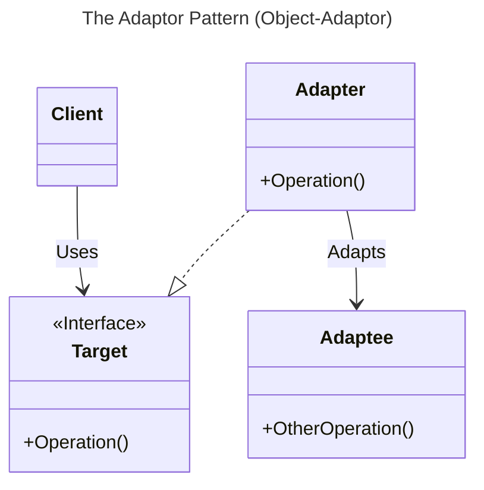

# Chapter 12: The Adaptor Pattern

- [Notes](#notes)
  - [Moving Data Between Lists](#moving-data-between-lists)
  - [Making an Adaptor](#making-an-adaptor)
  - [The Class Adapter](#the-class-adapter)
  - [Beyond Basic Adapters](#beyond-basic-adapters)
    - [Two-Way Adapters](#two-way-adapters)
    - [Pluggable Adapters](#pluggable-adapters)
- [Summary](#summary)

## Notes

- The **Adaptor Pattern** converts the interface of one class to another
- There are two styles of adaptors
  1. *Object* adaptors
      - The adapting class contains an instance of the adapted object
        and delegates to this instance
  2. *Class* adaptors
      - The client uses multiple inheritance or interfaces to implement
        both the expected and pre-existing implementation



### Moving Data Between Lists

- Consider a simple case of a program that consists of a list of student
  names
  - A client can enter new names into the list
  - The user can then select a subset of the student names to be copied
    into another list
- Names are added at the top via an `Insert` button
  - Moved between the two lists via an `Add` and `Remove` list
- This initial implementation is straightforward and can be found in
  [student_list.py](Examples/01-student-list/student_list.py)
  - We simply moving data between the two listboxes with a class

    ``` python
    class DerivedListbox(tk.Listbox):
        def __init__(self, root) -> None:
            super().__init__(root)

        def selected(self):
            selection = self.curselection()
            selected_index = selection[0]
            return self.get(selected_index)

        def delete_selected(self) -> None:
            selection = self.curselection()
            selected_index = selection[0]
            self.delete(selected_index)

        def append(self, text: str) -> None:
            self.insert(tk.END, text)
    ```

  - We then implement our UI with a standard builder class and method

    ``` python
    class UIBuilder:
        def __init__(self, root):
            self.root = root

        def build(self):
            self.root.geometry("300x200")
            self.root.title("Student List")

            self.entry = tk.Entry(self.root)
            self.entry.grid(row=0, column=0)

            self.left_list = DerivedListbox(self.root)
            self.left_list.grid(row=1, column=0, rowspan=4)

            self.right_list = DerivedListbox(self.root)
            self.right_list.grid(row=1, column=2, rowspan=4)

            def enter_name():
                text = self.entry.get()
                self.left_list.append(text)
                self.entry.delete(0, tk.END)

            entry_button = tk.ttk.Button(self.root, text="Insert", command=enter_name)
            entry_button.grid(row=0, column=1, sticky=tk.W)

            def move_selection(source: DerivedListbox, destination: DerivedListbox):

                selected = source.selected()
                destination.append(selected)
                source.delete_selected()

            add_button = tk.ttk.Button(
                self.root,
                text="Add",
                command=lambda: move_selection(self.left_list, self.right_list),
            )
            add_button.grid(row=1, column=1)

            remove_button = tk.ttk.Button(
                self.root,
                text="Remove",
                command=lambda: move_selection(self.right_list, self.left_list),
            )
            remove_button.grid(row=2, column=1)
    ```

  - The resulting program should look like,

    

### Making an Adaptor

- Consider now that we want the right-side to display data differently
  - For example a table of IQ and test scores
- We want to be able to keep using the `UIBuilder` class
  - But we don’t want to have to change the interface to the listboxes
- We want to create an adaptor that can convert the data for a
  `Treeview` widget to our listbox
  - The adaptor here accepts an existing tree widget and adapts the
    method implementations as required

    1. `selected`
        - This is updated to a straightforward retrieval on the tree
    2. `delete_selected`
        - This is updated to a straightforward delete on the tree
    3. `append`
        - This is the most complicated
        - The insert itself is simple
        - However we need to provide values for `IQ` and `Score`
          - In this case we use a simple random number generation
          - In a more realistic example this might trigger a database
            look-up on the provided name

  ``` python
    class ListboxAdaptor(DerivedListbox):
        def __init__(self, root, tree):
            super().__init__(root)
            self.tree = tree
            self.idx = 1

        @override
        def selected(self):
            tree_row = self.tree.focus()
            row = self.tree.item(tree_row)
            return row.get("text")

        @override
        def delete_selected(self) -> None:
            tree_row = self.tree.focus()
            self.tree.delete(tree_row)

        @override
        def append(self, text: str) -> None:

            def random_iq():
                return random.randint(a=115, b=145)

            def random_score():
                return random.randint(a=25, b=35)

            self.tree.insert("", self.idx, text=text, values=(random_iq(), random_score()))
  ```

  - Now we need to update our `UIBuilder` to create the tree, the
    `build` method is modified accordingly

  ``` python
        self.tree = tk.ttk.Treeview(self.root)
        self.tree["columns"] = ("IQ", "Score")
        self.tree.column(column="#0", width=100, minwidth=100, stretch=tk.NO)
        self.tree.column(column="IQ", width=50, minwidth=50, stretch=tk.NO)
        self.tree.column(column="Score", width=50, minwidth=50, stretch=tk.NO)

        self.tree.heading(column="#0", text="Name")
        self.tree.heading(column="IQ", text="IQ")
        self.tree.heading(column="Score", text="Score")

        self.right_list = ListboxAdaptor(self.root, self.tree)
        self.tree.grid(row=1, column=2, rowspan=4)
  ```

  - As you can see from above once we’ve created the tree we simply
    replace the `self.right_list` assignment with `ListboxAdaptor`
    instead of `DerivedListbox`
    - We also need to put `tree` onto the grid rather than `right_list`
      itself
- Observe that we don’t need to then rewire any of the code that depends
  on `right_list`
  - This is because it still obeys the same interface as before, and is
    for all intents and purposes the *same* object to the others
- The full code can be seen in
  [student_table.py](Examples/02-student-table/student_table.py)
  - The program should look like below

    

### The Class Adapter

- The above is an example of an *object adaptor* because it wraps an
  instance of the object being adapted
  - Here the `Treelist`
- A *class adaptor* would instead derive a new class that provides the
  additional methods of the interface being targeted

### Beyond Basic Adapters

#### Two-Way Adapters

- Two way adapters are a special technique that allow adapters to be
  viewed as either side of the adaptee vs target
- Typically implemented via a class adapter since the base class methods
  are automatically inherited
- However, this works only if base class methods are not overridden to
  provide different behaviours

#### Pluggable Adapters

- A pluggable adapter adapts dynamically to one of several classes
- The adapter can only adapt to classes it recognises
- Usually the adapter is configured by the differing constructors
  - Or in python `classmethod` or attributes

## Summary

- A class adapter

  - Doesn’t work when adapting a class and all it’s subclasses since it
    fixed to derive from a specified subclass
  - The adapter can change some of the adapted class methods
    - Others can be used unchanged

- An object adapter

  - Subclasses can be adapted by passing them into the constructor
  - Requires explicitly provided forwarded method signatures for any
    methods on the wrapped subclass you wish to make part of the
    adapter’s interface
