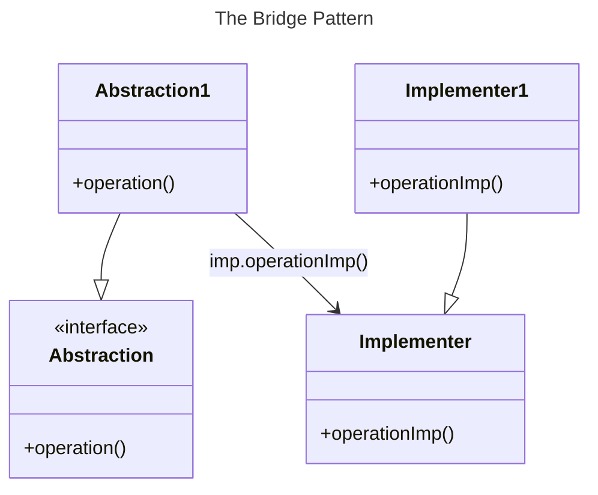

# Chapter 13: The Bridge Pattern


- [Notes](#notes)
  - [Defining the Bridge and Implementation
    Classes](#defining-the-bridge-and-implementation-classes)
  - [Creating the User Interface](#creating-the-user-interface)
  - [Extending the Bridge](#extending-the-bridge)
- [Summary](#summary)

## Notes

- The **Bridge Pattern** appears superficially like that of the adapter
  pattern
  - In that we decouple an interface from a class that implements the
    interface
  - In the case of the adapter the coupling serves to help us link two
    classes or interfaces not originally co-designed
- In the bridge pattern we decouple the interface from the
  implementation so that we can vary both independently
  - Allows us to vary the interface
    - Potentially then implement it with multiple classes
  - Or, vary the implementation



- Suppose we have a program displaying products in a window

  - The simplest interface is that of a listbox
  - After a number of product’s have been sold we may also wish to view
    a table of sales figures for the products

- These are distinct views, but we want to capture them under one class
  interface

- First we define our basic `Product` class for the example

  ``` python
    class Product:
        """
        A basic class representing a product

        Parameters
        ----------
        name : str
            The name of the product
        count : int
            Stock level of the product
        """

        @classmethod
        def from_string(cls, product: str) -> Product:
            """
            Create a product from a delimited string

            The string must be delimited as `"name--count"`

            Parameters
            ----------
            product : str
                The delimited string to parse

            Returns
            -------
            Product
                Product created from the delimited string
            """
            name, count = product.split("--")
            name = name.strip()
            count = int(count.strip().replace(",", ""))

            return cls(name, count)

        def __init__(self, name: str, count: int) -> None:
            """
            Create a new Product

            Parameters
            ----------
            name : str
                Product name
            count : int
                Current product stock level
            """
            self.name = name
            self.count = count


    def parse_products_from_file(file: str) -> Sequence[Product]:
        """
        Parse a list of products from a file

        Each of the products in the file must be a delimited string
        following the conventions of `Product.from_string`

        Parameters
        ----------
        file : str
            path to the file to parse

        Returns
        -------
        Sequence[Product]
            Products parsed from the file
        """
        with open(file) as file_stream:
            products = [Product.from_string(line) for line in file_stream.readlines()]
        return products
  ```

- This consists of a basic class containing a `name` and a `count`

  - Plus a class method to convert from a string

- We then also define a free function `parse_products_from_file` which
  reads lines from a file and converts them into a list of `Product`
  instances

### Defining the Bridge and Implementation Classes

- We start by defining a basic bridge class

  - Only has one method, it should receive data and pass it on to a
    display class

  ``` python
    class Bridge(tk.ttk.Frame):
        """
        Bridge class defining a simple abstract interface
        """

        @abc.abstractmethod
        def add_data(self, products: Sequence[Product]) -> None:
            """
            Add data to a display
            """
            pass
  ```

- Next we need to define our implementation classes

- These are usually a more elaborate low-level interface

  - Here the implementation classes provide methods for adding specific
    lines

  ``` python
    class Display(tk.Widget):
        """
        Display class defining an abstract implementation
        """

        @abc.abstractmethod
        def add_lines(self, lines: Sequence[Product]) -> None:
            """
            Add lines to a display

            Parameters
            ----------
            lines : Sequence[Product]
                lines to add
            """
            pass
  ```

- Now with the basic structure for our pattern set-up we provide
  concrete implementations

  1.  For the `Listbox`

      ``` python
         class ListBoxDisplay(Display, tk.Listbox):
             """
             A simple Product display using a Listbox
             """

             def __init__(self, frame) -> None:
                 """
                 Create a new ListBoxDisplay

                 Parameters
                 ----------
                 frame : tk.ttk.Frame
                     The frame to place the widget into
                 """
                 super().__init__(frame)

             def add_lines(self, lines: Sequence[Product]) -> None:
                 for line in lines:
                     self.insert(tk.END, line.name)
      ```

  2.  For the `Treeview` widget

      ``` python
         class TreeviewDisplay(Display, tk.ttk.Treeview):
             """
             A simple Product display using a Treeview
             """

             def __init__(self, frame) -> None:
                 super().__init__(frame)
                 self["columns"] = "quantity"
                 self.column("#0", width=150, minwidth=100, stretch=tk.NO)
                 self.column("quantity", width=50, minwidth=50, stretch=tk.NO)

                 self.heading("#0", text="Part")
                 self.heading("quantity", text="Qty")

                 self.idx = 0

             def add_lines(self, lines: Sequence[Product]) -> None:

                 for line in lines:
                     self.insert("", self.idx, text=line.name, values=(line.count,))
      ```

- The last step is to then define a concrete implementation of our
  bridge interface to work with the `Display`

  ``` python
    class DisplayBridge(Bridge):
        """
        Concrete implementation of the Bridge connecting it to a display

        Attributes
        ----------
        display
            the display being bridged
        """
        def __init__(self, display: Display) -> None:
            """
            Create a new `DisplayBridge` instance

            Parameters
            ----------
            display : Display
                the display to bridge
            """
            self.display = display
            self.display.pack()

        def add_data(self, products: Sequence[Product]) -> None:
            self.display.add_lines(products)
  ```

### Creating the User Interface

- With all the components defined with can now create our UI

  ``` python
    class UIBuilder:
        """
        Creates the product UI

        The UI is not initialised until the `build` method is called
        """

        def __init__(self, root: tk.Tk) -> None:
            """
            Create a new UIBuilder

            Parameters
            ----------
            root : tk.Tk
                The base window to build the UI on
            """
            self.root = root

        def build(self) -> None:
            """
            Build the UI
            """
            self.root.geometry("335x200")
            self.root.title("Products")

            products = parse_products_from_file("products.txt")
            left_frame = tk.ttk.Frame(self.root, width=200, borderwidth=2, relief=tk.GROOVE)
            left_label = tk.ttk.Label(left_frame, text="Customer View")
            left_label.pack(fill=tk.X)

            listbox_display = ListBoxDisplay(left_frame)
            listbox_bridge = DisplayBridge(listbox_display)
            listbox_bridge.add_data(products)
            left_frame.grid(row=0, column=0, sticky=tk.N + tk.W)

            right_frame = tk.ttk.Frame(self.root)
            right_frame.grid(row=0, column=1, sticky=tk.E)
            right_label = tk.ttk.Label(right_frame, text="Executive View")
            right_label.pack(fill=tk.X)

            treeview_display = TreeviewDisplay(right_frame)
            treeview_bridge = DisplayBridge(treeview_display)
            treeview_bridge.add_data(products)
  ```

- The full program is given in [bridge.py](Examples/01-bridge/bridge.py)

  - The resulting program should look below

    

### Extending the Bridge

- The goal of the bridge pattern is to decouple the client-facing
  interface from the specific implementation
  - The advantage this provides is clear when we either want to modify
    the interface, or the implementation
  - For example, suppose we want to have the products displayed in
    alphabetical order
    - Rather than modifying every `Display` implementation, we just
      provide a new `Bridge` implementation
      - This new `Bridge` has the same interface but internally sorts
        data before passing it onto the display

  ``` python
    class SortedDisplayBridge(Bridge):
    """
    Concrete implementation of the Bridge connecting it to a display,
    extended with additional functionality to sort the input alphabetically

    Attributes
    ----------
    display
        the display being bridged
    """

    def __init__(self, display: Display) -> None:
        """
        Create a new `SortedDisplayBridge` instance

        Parameters
        ----------
        display : Display
            the display to bridge
        """
        self.display = display
        self.display.pack()

    def add_data(self, products: Sequence[Product]) -> None:
        products = sorted(products, key=lambda x: x.name)
        self.display.add_lines(products)
  ```
- The only change in the client facing code is modifying the code to
  create a `SortedDisplayBridge` rather than a `DisplayBridge`
- We can also vary the implementation as well by simply adding new ones
  that can be wrapped by a bridge
  - For example, suppose we want to modify the customer view so it now
    displays products as a tree
    - We simply define a new implementation of `Display` and modify the
      clent code to create this widget rather than the `ListBoxDisplay`

``` python
class TreeDisplay(Display, tk.ttk.Treeview):
    """
    A simple Product display using a Treeview to display a tree
    """

    def __init__(self, frame) -> None:
        """
        Create a new TreeDisplay instance

        Parameters
        ----------
        frame :
            Frame to place the display within
        """
        super().__init__(frame)
        self.column("#0", width=150, minwidth=100, stretch=tk.NO)
        self.idx = 0

    def add_lines(self, lines: Sequence[Product]) -> None:
        for line in lines:
            product_line = self.insert("", self.idx, text=line.name)
            self.insert(product_line, tk.END, text=str(line.count))
            self.idx += 1
```

- The full code can be seen in
  [extended_bridge.py](./Examples/02-extended-bridge/extended_bridge.py)

- The resulting program should look like below,

  

## Summary

1.  The Bridge pattern keeps the client-facing interface distinct from
    the implementation interface
    - Enables modifying the internal interface or choice of concrete
      implementation without impacting the client
    - Decouples changes to internal systems from the client-facing
      consumption
2.  The implementation and the bridge can be extended independently with
    minimal coupling
3.  Implementation details can be hidden from the client via limiting
    the exposed interface of the bridge
