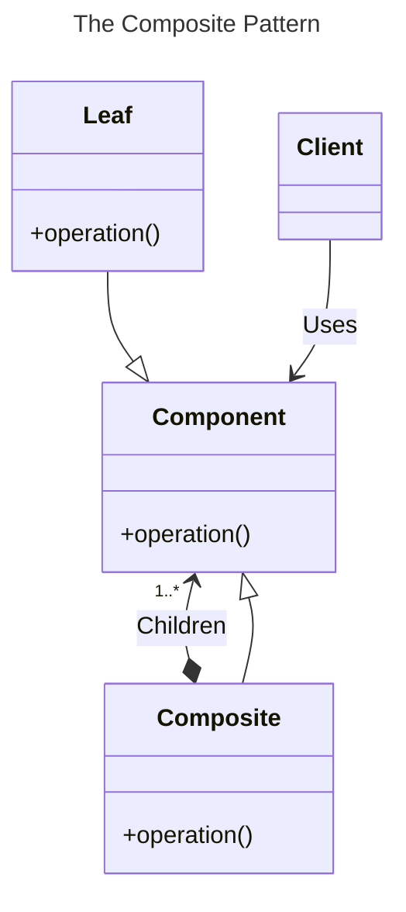
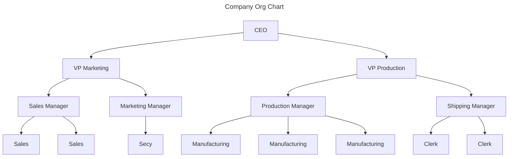

# Chapter 14: The Composite Pattern


- [Notes](#notes)
  - [Implementing a Composite](#implementing-a-composite)
    - [Computing Salaries](#computing-salaries)
    - [Providing an Interface](#providing-an-interface)
  - [Creating a GUI](#creating-a-gui)
  - [Using Doubly-Linked Lists](#using-doubly-linked-lists)
  - [Intent of the Composite Pattern](#intent-of-the-composite-pattern)
  - [Implementation Issues](#implementation-issues)
    - [Recursive Calls](#recursive-calls)
    - [Ordering Components](#ordering-components)
    - [Caching Results](#caching-results)
- [Summary](#summary)

## Notes

- A common programming paradigm occurs when developing objects that
  themselves may be the object, or a smaller part of a composite
  - For example, a tree can be viewed as both the whole object and also
    comprised of sub-trees which are themselves whole objects
- The **Composite Pattern** is designed to provide an implementation
  flexible to either use-case
- To summarise, a *composite* is a collection of objects
  - Each object in the collection may be a further collection or a
    primitive



- With composites we have to navigate providing a simple interface for
  all objects
  - Maintain the ability to distinguish between internal nodes and leafs

  - One option is to have distinct interfaces for leaves and internal
    nodes e..g for an employee hierarchy

    ``` python
        class Leaf:

            def name():
                pass

            def salary():
                pass

        class InternalNode:
            def subordinates():
                pass
            def add(self, employee):
                pass
            def get_child(self, name: str):
                pass
    ```

  - However, it is preferable to have one interface

    - This can pose challenges for how we handle methods that only make
      sense for one type of object
    - e.g. We might not be able to add to leaf nodes, or get a child
      from one

  - A solution is to use exceptions to handle the invalid operations

### Implementing a Composite

- Consider implementing a small company hierarchy
  - Run by a CEO
  - Broken down into a marketing department and a production department
    - Each run by a Vice President
  - Departments have teams led by a manager
  - The overall team hierarchy is then given by



#### Computing Salaries

- Each employee draw’s a salary
- We might want to ask what the cost of an individual employee is
  - This is simply their salary
- We alternatively might like to ask what the cost of a department or
  team is
  - This can be considered as the sum of the department head’s salary
    and that of their recursive reports
- Ideally we could implement this through one interface, as a composite
  - For now, rather than defining an abstract interface first we’ll use
    a base `JobPosition` class and a `ManagingJobPosition`

  - The `JobPosition` is a simple class that consists of a `name` and
    `salary`

    - It’s unable to have subordinates, enforced via exceptions

    ``` python
    class JobPosition:
        """
        Represents an job position with a name and salary

        The base class is not able to manage a position

        Attributes
        ----------
        name: str
            The name of the job position
        salary: decimal.Decimal
            Salary attached to this position
        """

        def __init__(self, name: str, salary: decimal.Decimal) -> None:
            """
            Create a new `JobPosition` with an associated name and salary

            Parameters
            ----------
            name : str
                The job title
            salary : decimal.Decimal
                Role's salary
            """
            self.name = name
            self.salary = salary

        def __str__(self) -> str:
            return f"{self.name} {self.salary}"

        @property
        def cost(self) -> decimal.Decimal:
            """
            The cost of this position and all subordinate positions

            Returns
            -------
            decimal.Decimal
                cost of this job position
            """
            return self.salary

        @property
        def subordinates(self) -> list[JobPosition]:
            """
            The list of direct subordinates to this role

            Returns
            -------
            list[JobPosition]
                Direct reports to this position, empty if none exist
            """
            return []

        def add_direct_report(self, employee: JobPosition) -> None:
            """
            Add a direct report to this employee

            Parameters
            ----------
            employee : JobPosition
                The position to add as a direct report

            Raises
            ------
            EmployeeException
                Raised if this employee cannot accept direct reports
            """
            raise EmployeeException("Employee is not authorised to supervise")

        def print_hierarchy(self, indent: int = 0) -> None:
            """
            Pretty print the job with a given indent

            Designed to be able to recursively pretty print an org chart

            Parameters
            ----------
            indent : int, optional
                amount of whitespace to indent this job description, by default 0
            """
            print(" " * indent + self.__str__())

        def get_child(self, name: str) -> JobPosition | None:
            """
            Retrieve the child job position with the given name

            Recursively searches through all reports and returns the first match

            Parameters
            ----------
            name : str
                position title to retrieve

            Returns
            -------
            JobPosition | None
                First JobPosition found matching the name,
                or `None` if no matches found
            """
            return None
    ```

    - Most of the methods here are designed to operate on children, so
      we need to set-up our interface to handle those
      - `cost` is a property here, that is designed to represent the
        cost of a position and all it’s subordinates
        - This makes it distinct from the position’s salary
      - `__str__` and `print_hierarchy` are designed to help pretty
        print our org tree
    - `add_direct_report`, `get_child`, and `subordinates` are all
      designed to work on child nodes so we implement sufficient
      placeholders

  - Now we need to implement our `ManagingJobPosition` that can handle
    subordinates

    ``` python
    class ManagingPosition(JobPosition):
        """
        Represents an job position capable of managing
        subordinates

        Attributes
        ----------
        name: str
            The name of the job position
        salary: decimal.Decimal
            Salary attached to this position
        """

        def __init__(self, name, salary: decimal.Decimal) -> None:
            super().__init__(name, salary)
            self._subordinates: list[JobPosition] = []

        @property
        def cost(self) -> decimal.Decimal:
            total_cost = sum([subordinate.cost for subordinate in self.subordinates])
            if total_cost:
                return total_cost
            else:
                return decimal.Decimal(0)

        @property
        def subordinates(self) -> list[JobPosition]:
            return self._subordinates

        def add_direct_report(self, employee: JobPosition) -> None:
            self._subordinates.append(employee)

        def print_hierarchy(self, indent: int = 0) -> None:
            super().print_hierarchy(indent)  # print this level
            for child in self.subordinates:
                child.print_hierarchy(indent=indent + 2)

        def get_child(self, name: str) -> JobPosition | None:
            for child in self.subordinates:
                if child.name == name:
                    return child
                elif found := child.get_child(name):
                    return found
            return None
    ```
- The code for these classes is provided in the
  [employees.py](Examples/01-org-chart/employees.py) module

#### Providing an Interface

- For the above program we can provide a basic CLI interface which
  simply prints out the organisation chart as an indented tree

  - This is done via the `print_hierarchy` method

- Here we’ll define a `UIBuilder` class and try and write a generic
  interface that can be replaced by a GUI without having to change the
  calling code

  ``` python
    class UIBuilder:
        def build(self):
            ceo = employees.ManagingPosition("CEO", decimal.Decimal(200_000))

            # Create marketing hierarchy
            marketing_vp = employees.ManagingPosition(
                "Vice President (Marketing)", salary=decimal.Decimal(100_000)
            )

            sales_mgr = employees.ManagingPosition(
                "Manager (Sales)", salary=decimal.Decimal(50_000)
            )
            marketing_mgr = employees.ManagingPosition(
                name="Manager (Marketing)", salary=decimal.Decimal(50_000)
            )

            ceo.add_direct_report(marketing_vp)

            marketing_vp.add_direct_report(sales_mgr)
            marketing_vp.add_direct_report(marketing_mgr)

            SALARY_MAX_SHIFT = 10_000
            for i in range(0, 3):
                sales_mgr.add_direct_report(
                    employees.JobPosition(
                        f"Sales ({i})",
                        salary=decimal.Decimal(
                            30_000 + random.randint(0, SALARY_MAX_SHIFT)
                        ),
                    )
                )

            marketing_mgr.add_direct_report(
                employees.JobPosition("Secy", salary=decimal.Decimal(20_000))
            )

            # create production hierarchy
            production_vp = employees.ManagingPosition(
                name="Vice President (Production)", salary=decimal.Decimal(100_0000)
            )

            ceo.add_direct_report(production_vp)

            production_mgr = employees.ManagingPosition(
                "Manager (Production)", salary=decimal.Decimal(40_000)
            )
            shipping_mgr = employees.ManagingPosition(
                "Manager (Shipping)", salary=decimal.Decimal(35_000)
            )

            production_vp.add_direct_report(production_mgr)
            production_vp.add_direct_report(shipping_mgr)

            for i in range(0, 4):
                production_mgr.add_direct_report(
                    employees.JobPosition(
                        f"Manufacturing ({i})",
                        salary=decimal.Decimal(
                            25_000 + random.randint(0, SALARY_MAX_SHIFT)
                        ),
                    )
                )

            for i in range(0, 4):
                shipping_mgr.add_direct_report(
                    employees.JobPosition(
                        f"Clerk ({i})",
                        salary=decimal.Decimal(
                            20_000 + random.randint(0, SALARY_MAX_SHIFT)
                        ),
                    )
                )

            self.org_chart = ceo

        def salary_span(self, name) -> None:
            if name == self.org_chart.name:
                cost = self.org_chart.cost
            elif department := self.org_chart.get_child(name):
                cost = department.cost
            else:
                print("Job Position not found!")
                return
            print(f"Salary span for {name}: {cost}")

        def build_tree(self) -> None:
            self.org_chart.print_hierarchy()

            while (name := input("Enter position to determine cost (q for quit): ")) != "q":
                self.salary_span(name)


    def main():
        ui = UIBuilder()
        ui.build()
        ui.build_tree()
  ```

- When we run the program we should see output like the below

  ``` shell
    CEO 200000
        Vice President (Marketing) 100000
            Manager (Sales) 50000
                Sales (0) 36667
                Sales (1) 39993
                Sales (2) 38315
            Manager (Marketing) 50000
                Secy 20000
        Vice President (Production) 1000000
            Manager (Production) 40000
                Manufacturing (0) 29975
                Manufacturing (1) 34897
                Manufacturing (2) 32323
                Manufacturing (3) 32117
            Manager (Shipping) 35000
                Clerk (0) 29859
                Clerk (1) 26294
                Clerk (2) 22393
                Clerk (3) 28674
    Enter position to determine cost (q for quit): Manager (Shipping)
    Salary span for Manager (Shipping): 107220
    Enter position to determine cost (q for quit):
  ```

- The full code can be found in
  [org_chart_console.py](Examples/01-org-chart/org_chart_console.py)

### Creating a GUI

- Next we can implement a graphical interface allowing us to view this
  org chart as a tree
  - We want to be able to select a job position, and see the cost
    associated with that position and it’s subordinates
  - We can do this with a basic treeview
- We’ll create a new version of the `UIBuilder` class
  - We do some refactoring, moving out the code that sets up the
    organisation tree into a separate method `build_org_chart`

    ``` python
    def build_org_chart(self):

        ceo = employees.ManagingPosition("CEO", decimal.Decimal(200_000))

        # Create marketing hierarchy
        marketing_vp = employees.ManagingPosition(
            "Vice President (Marketing)", salary=decimal.Decimal(100_000)
        )

        sales_mgr = employees.ManagingPosition(
            "Manager (Sales)", salary=decimal.Decimal(50_000)
        )
        marketing_mgr = employees.ManagingPosition(
            name="Manager (Marketing)", salary=decimal.Decimal(50_000)
        )

        ceo.add_direct_report(marketing_vp)

        marketing_vp.add_direct_report(sales_mgr)
        marketing_vp.add_direct_report(marketing_mgr)

        SALARY_MAX_SHIFT = 10_000
        for i in range(0, 3):
            sales_mgr.add_direct_report(
                employees.JobPosition(
                    f"Sales ({i})",
                    salary=decimal.Decimal(
                        30_000 + random.randint(0, SALARY_MAX_SHIFT)
                    ),
                )
            )

        marketing_mgr.add_direct_report(
            employees.JobPosition("Secy", salary=decimal.Decimal(20_000))
        )

        # create production hierarchy
        production_vp = employees.ManagingPosition(
            name="Vice President (Production)", salary=decimal.Decimal(100_0000)
        )

        ceo.add_direct_report(production_vp)

        production_mgr = employees.ManagingPosition(
            "Manager (Production)", salary=decimal.Decimal(40_000)
        )
        shipping_mgr = employees.ManagingPosition(
            "Manager (Shipping)", salary=decimal.Decimal(35_000)
        )

        production_vp.add_direct_report(production_mgr)
        production_vp.add_direct_report(shipping_mgr)

        for i in range(0, 4):
            production_mgr.add_direct_report(
                employees.JobPosition(
                    f"Manufacturing ({i})",
                    salary=decimal.Decimal(
                        25_000 + random.randint(0, SALARY_MAX_SHIFT)
                    ),
                )
            )

        for i in range(0, 4):
            shipping_mgr.add_direct_report(
                employees.JobPosition(
                    f"Clerk ({i})",
                    salary=decimal.Decimal(
                        20_000 + random.randint(0, SALARY_MAX_SHIFT)
                    ),
                )
            )

        self.org_chart = ceo
    ```

  - We can then rewrite our `build` to set-up the UI

    - This is pretty straight forward
      - We set up some our tree, add a button to click that calculates
        the cost of the selected subtree and provide an entry to report
        it in
    - We have factored out the code responsible for mapping an input
      name to the correct part of the org chart tree and retrieving the
      cost to an internal method `self._calculate_cost`

    ``` python
    def build(self):

        self.build_org_chart()

        self.root = tk.Tk()
        self.root.geometry("200x300")
        self.root.title("Organisation Chart")

        self.frame = tk.ttk.Frame(self.root)
        self.frame.pack()

        self.tree = tk.ttk.Treeview(self.frame)
        entry = tk.ttk.Entry(self.frame)

        def calculate_salary():
            tree_focus = self.tree.focus()
            tree_item = self.tree.item(tree_focus)
            name = tree_item["text"]

            cost = self._calculate_cost(name)
            if cost is not None:
                entry.delete(0, tk.END)
                entry.insert(0, str(cost))
            else:
                tk.messagebox.showwarning(
                    title="Search Failed", message="Job Position Not Found!"
                )

        salary_button = tk.ttk.Button(
            self.frame, text="Calculate Costs", command=calculate_salary
        )

        self.tree.column("#0", width=250, minwidth=250, stretch=tk.NO)
        self.tree.pack()
        salary_button.pack()
        entry.pack()
    ```

  - The last step is to populate our tree which we do by modifying the
    `build_tree` method

    - We need to traverse the tree to add it to the treeview
    - We don’t want to add this method explicitly to the `JobPosition`
      interface since that couples the data model to the graphical
      presentation
      - Instead we define a closure in `build_tree` to perform the
        traversal

    ``` python
    def build_tree(self) -> None:

        self.tree.heading("#0", text="Organisation Chart")

        def traverse_org(treeview_node: str, position: employees.JobPosition):

            subordinates = position.subordinates
            if not subordinates:
                return
            for sub_position in subordinates:
                new_node = self.tree.insert(
                    treeview_node, tk.END, text=sub_position.name
                )
                traverse_org(new_node, sub_position)

        root_node = self.tree.insert("", index=tk.END, text=self.org_chart.name)
        traverse_org(root_node, self.org_chart)
        tk.mainloop()
    ```

  - Then to conform with the `build_tree` interface for console, we
    start the tkinter main loop to run the program
- The full program can be found in
  [org_chart_gui.py](Examples/01-org-chart/org_chart_gui.py)
  - The resulting program should look similar to the below

  

### Using Doubly-Linked Lists

- The current program has the issue that we can traverse *down* the
  tree, but we can’t traverse *up* the tree
  - We can add this by making each `JobPosition` remember it’s parent
  - For example, we could use this to add the ability to see a
    position’s report chain
    - The relevant changes to the `JobPosition` class are

      ``` python
        def __init__(
            self, name: str, salary: decimal.Decimal, parent: JobPosition | None = None
        ) -> None:
            """
            Create a new `JobPosition` with an associated name and salary

            Parameters
            ----------
            name : str
                The job title
            salary : decimal.Decimal
                Role's salary
            parent : JobPosition | None, optional
                Role's direct supervisor if it exists, by default None
            """
            self.name = name
            self.salary = salary
            self.parent = parent

        @property
        def supervisor(self) -> JobPosition | None:
            """
            Job Position's direct supervisor

            Returns
            -------
            JobPosition | None
                Immediate supervisor if the position exists, else `None`
            """
            return self.parent
      ```

    - We can then provide a button in our UI for the user to query the
      report chain

      ``` python
        def supervision_chain():
            tree_focus = self.tree.focus()
            tree_item = self.tree.item(tree_focus)
            name = tree_item["text"]

            if name == self.org_chart.name:
                tk.messagebox.showinfo(
                    title="Report Chain", message="No direct supervisor"
                )
                return

            chain = ""
            position = self.org_chart.get_child(name)
            while position:
                chain += position.name + "\n"
                position = position.supervisor
            if chain:
                tk.messagebox.showinfo(title="Report Chain", message=chain)
            else:
                tk.messagebox.showwarning(
                    title="Position Missing", message="Position not fouund!"
                )

        supervision_button = tk.ttk.Button(
            self.frame, text="Display Report Chain", command=supervision_chain
        )
      ```
  - The full code can be found in
    [supervision_chain.py](Examples/02-report-chain/supervision_chain.py)
    and the correspondingly updated
    [employees.py](Examples/02-report-chain/employees.py)
    - The resulting program should look like,

    

> [!NOTE]
>
> **Tree Structures and the Organisation Hierarchy**
>
> One of the observations one might want to make in the previous
> examples are that a lot of the client facing code has to differentiate
> between the root node of the tree and the rest of the children. For
> example when searching for a match we have to check the root node
> explicitly, then the sub-tree. Additionally when constructing the
> treeview we also have to explicitly handle the root node, then recurse
> into our tree. This is a fairly common paradigm, one potential option
> around it would be to use a structure that has a special root node,
> that can forward onto the actual root in such a way that the entire
> tree can be treated the same way

### Intent of the Composite Pattern

- The Composite pattern serves to allow us to construct a tree of
  related classes via a common interface
- In simple cases where we do not need to distinguish between leaves and
  internal nodes we can sometimes use a single interface or class to
  represent both
  - For example in our implementation we distinguished between
    `ManagingJobPosition` and `JobPosition`
  - We might instead just have *one* type of job position, and let
    anyone manage
    - A managing job position is then denoted by having a non-empty list
      of subordinates
- In this case we don’t use exceptions to manage invalid calls on leaf
  nodes
  - leaf nodes can instead be dynamically promoted
- In cases where the number of leaves is high, it can be better to
  differentiate between the two to avoid the memory overhead with
  managing an empty list for each node

### Implementation Issues

- The Composite pattern can have some subtle implementation issues

#### Recursive Calls

- Many times the most obvious way to implement a method on a composite
  is via a recursive call
- For performance reasons where possible it is generally preferable to
  convert an explicitly recursive function call to something that
  utilises a loop
  - For example via a stack
- Another issue with recursive routines can be ensuring that references
  to the correct data structures or program state are properly set at
  each level of the recursion
  - For the example provided this is managed in two cases

    1.  When printing the hierarchy we have a recursively set `indent`
        parameter which controls the indentation
    2.  When parsing the hierarchy into the treeview we pass the parent
        row as a parameter
        - We also always insert a row by appending it, rather than
          manually maintaining an ordering
- One potential avenue if we need to maintain more complex access to
  state through a recursive call can be using something like an external
  class which is used to maintain that state, some options for managing
  this could be
  - A singleton class (See [Chapter
    8](../../II-Creational-Patterns/chapter-08/chapter-08.qmd))
  - A static class
  - A global or local object
  - Class Attributes

#### Ordering Components

- Sometimes ordering can be important when returning results
  - For example consider the standard different tree traversal orderings

    1.  Pre order
    2.  In order
    3.  Post order
    4.  Level order

  - We might want orderings as well that are more specific to the data

    - e.g. alphabetical
- These orderings as such can be distinct from the actual ordering of
  the tree
  - In these cases we must do additional work to transform the composite
    ordering into the desired target ordering

#### Caching Results

- A common technique with expensive function calls is to use
  *memoisation* or *caching*
  - This is common for recursive data structures and especially useful
    in tree structures
- As always there is a trade-off, caching may not be worth it if,
  - If the underlying data changes frequently to invalidate the cache,
    or
  - The calculation is cheap and fast equivalent to the cost of storing
    and retrieving the cache

## Summary

- The Composite Pattern lets you build a tree of related classes
  - The resulting structure combines simple objects and complex objects
    into one common interface
- The client can handle both objects without having to distinguish
  between either type explicitly
- Composites can allow for flexibility in adding new components through
  a similar interface
- A disadvantage to be wary of is making a composite overly general
  - Can make it difficult to restrict classes or support specific
    functionality
