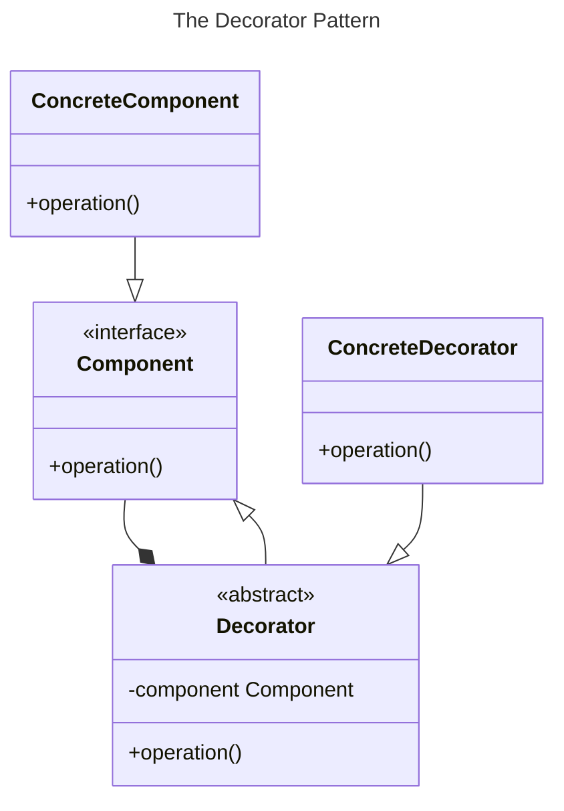

# Chapter 15: The Decorator Pattern


- [Notes](#notes)
  - [Decorating a Button](#decorating-a-button)
  - [Decorators in Python](#decorators-in-python)
  - [The Dataclass Decorator](#the-dataclass-decorator)
  - [Decorators, Adapters, Composites](#decorators-adapters-composites)
- [Summary](#summary)

## Notes

- The **Decorator Pattern** is a way of providing additional
  functionality to objects or functions without having to derive a new
  subclass

- For example, suppose we have two independent class hierarchies

  - Each wants to implement two identical behaviours

- Using a class-based approach we might need to implement a subclass for
  each subclass in the existing hierarchies implementing,

  1.  The first behaviour
  2.  The second behaviour
  3.  Both behaviours

- This rapidly leads to a large number of additional classes

- Instead we want to define the two behaviours distinctly and
  independent of the existing hierarchies such that they can be applied
  to *both*

- This pattern is called the *decorator pattern* because we want to
  *decorate* a class with additional behaviour, *without* changing it’s
  interface or implementation

- For example, we may want to decorate a button such that it is drawn
  with a special border

  - In all other respects it still looks and behaves like the same
    button

- Python specifically has support for *decorators*, this is a special
  syntax for higher order functions or objects that wrap another
  function or object and add behaviour without changing the associated
  name

  - They are directly inspired by the decorator pattern



### Decorating a Button

- Consider a borderless button
  - We want this icon to show up with a border when the user mouses over
    it
- We can view this as decorating a normal borderless button with a
  border whenever the mouse passes over it
- In this case we *decorate* a button by deriving from a button widget
  - Normally we would define the decorator to obey the abstract widget
    interface and wrap a button instance via method forwarding

``` python
class Decorator(tk.ttk.Button):
    def __init__(self, master, **kwargs):
        super().__init__(master, **kwargs)

        self.style = tk.ttk.Style()
        self.style.configure(style="Flat.TButton", relief=tk.FLAT)
        self.style.theme_use("alt")

        self.hover_style = tk.ttk.Style()
        self.hover_style.configure(style="Raise.TButton", relief=tk.RAISED)
        self.hover_style.theme_use("alt")

        self.configure(style="Flat.TButton")
        self.bind("<Enter>", func=lambda x: self.configure(style="Raise.TButton"))
        self.bind("<Leave>", func=lambda x: self.configure(style="Flat.TButton"))
```

- From above we can see that this behaves like a normal button, and we
  can still configure it like a normal button

  - However, we’ve now edited it so that it appears flat normally, but
    the buttons are raised once we mouse over them

- The full program can be found in
  [decorated_button.py](Examples/01-decorated-button/decorated_button.py)
  and should look like,

  

### Decorators in Python

- Python provides special support for generic decorators through the
  `@decorator` syntax

  - Often used to decorate classes, functions or methods

- For example in previous examples we’ve used decorators like,

  - `@classmethod` to indicate that a method defined for a class
    operates on the class rather than the instance
  - `@abc.abstractmethod` to indicate that a method is an abstract
    method that should be implemented by subclasses
  - `@typing.override` to indicate that a subclass method is supposed to
    override a superclass method

- Decorators in python are actually functions under the hood

  - The advantage of the decorator syntax is it does automatic name
    reassignment

  - i.e. the syntax

    ``` python
    @decorator
    def func():
        pass
    ```

    - is roughly equivalent to,

    ``` python
    func = decorator(func)
    ```

- To see how they work consider the following basic example,

  - You should see that rather than referring to a new function for the
    decorated result we simply reference `f` as before

  ``` python
    def deco(func):
        # add an attribute to the function
        func.label = "decorated"
        return func

    @deco
    def f():
        pass

    print(f.label)
  ```

      decorated

- For a slightly more complex example, consider

  ``` python
    def trace(func):
        def wrapper(*args, **kwargs):
            print("Before function call")
            func(*args, **kwargs)
            print("After function call")
        return wrapper

    @trace
    def hello_world():
        print("Hello, World!")

    hello_world()
  ```

      Before function call
      Hello, World!
      After function call

- Here the decorating function `trace` wants to wrap the function call
  with some print line debugging trace when it was called and when it
  finished

  - Rather than adding an attribute we define a new wrapper function,
    that accepts the `args` and `kwargs` for the original function
  - We then print the desired text either side of the function call
  - Since we are replacing the original function definition, we have to
    return this new function `wrapper`

### The Dataclass Decorator

- Dataclasses are designed to simplify the process of creating simple
  classes that can be considered as simple bags of data

  - Something like a record-type or struct in C

- Reduce the need to write boilerplate such as the `__init__` method

  - And more!

- For example if we had a simple `Employeee` class, we might normally
  write it as

  ``` python
    class Employee:
        def __init__(self, first_name, last_name, employee_number = 0):
            self.first_name = first_name
            self.last_name = last_name
            self.employee_number = employee_number
  ```

- Notice here our `__init__` method is doing simple forwarding from the
  provided arguments to the internal attributes

  - We can replicate this using a dataclass via

  ``` python
   import dataclasses

   @dataclasses.dataclass
   class Employee:
       first_name : str
       last_name : str
       employee_number : int = 0

   employee = Employee("Alice", "Bob", 1)
   print(employee)
  ```

      Employee(first_name='Alice', last_name='Bob', employee_number=1)

- The dataclass handles defining the `__init__` as well as some other
  basic methods

  - Like here `__repr__` to provide the string printing

- The one small difference, is that dataclass attributes are type-hinted

- Also note that the attributes are declared similar to how we would
  normally declare a class attribute

  - They are still instance attributes

### Decorators, Adapters, Composites

- Adapters, Decorators and Composites all share a similar design idea

- For example one could say that an Adapter *decorates* an existing
  class with a new interface

- However, the difference here is intent

  1.  An Adapter changes the interface of an existing class to match the
      interface of a different class
  2.  A Composite provides an interface that allows treating complex or
      simple objects the same
  3.  The decorator *changes* or *adds* behaviour to an existing class
      *without* changing it’s external facing interface

## Summary

- The Decorator Pattern is a flexible way of adding functionality to an
  existing class

- Enables customisation without having to define a new subclass for
  every possible combination of targeted behaviours

- The Decorator pattern can have downsides

  1.  The decorator and the enclosed component are distinct
      - Object type specific tests can fail
  2.  Overreliance on decorators can spread functionality out into many
      small classes and increase the challenge associated with
      maintaining a system
